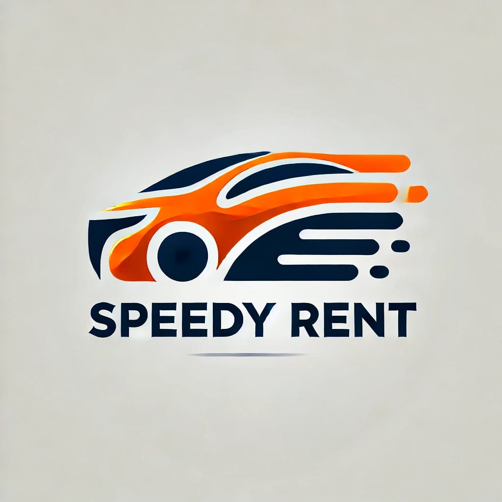
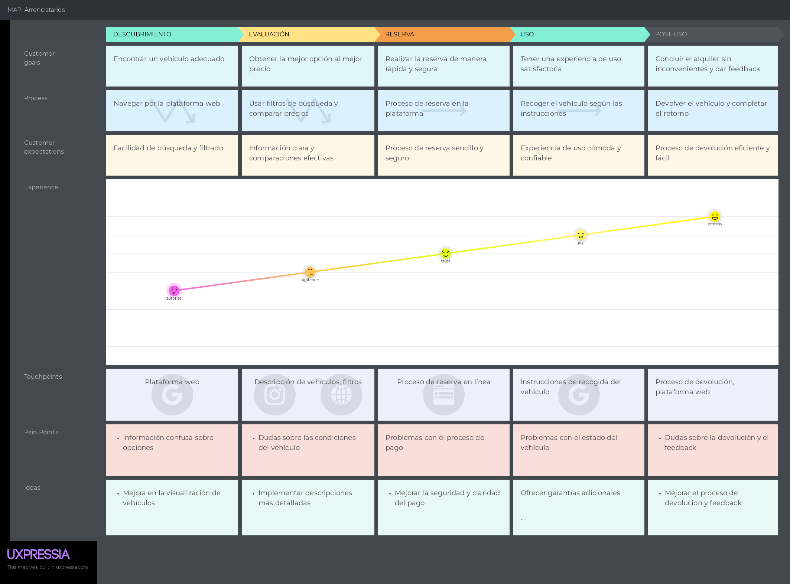
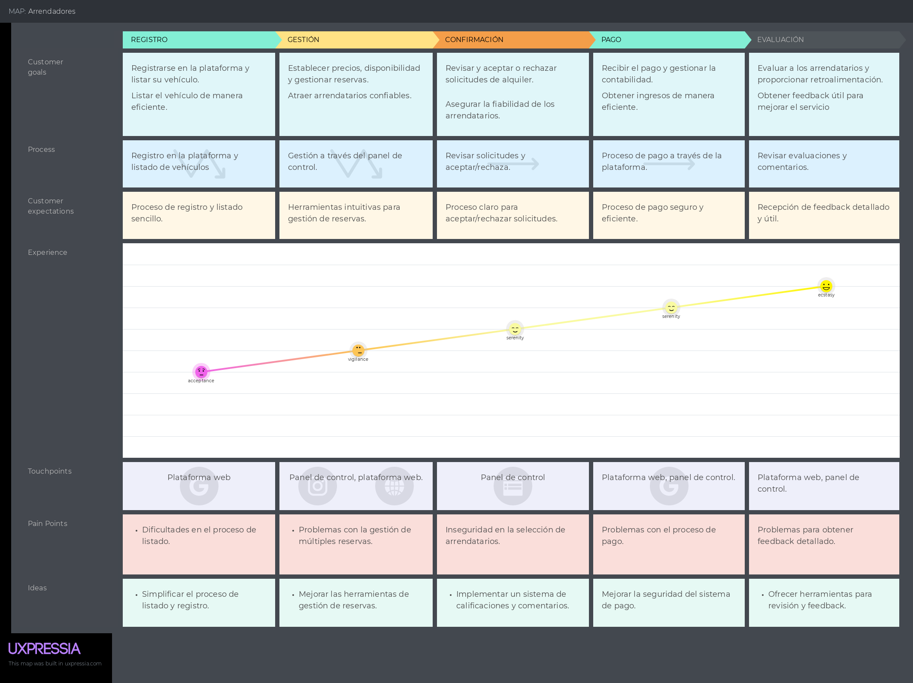
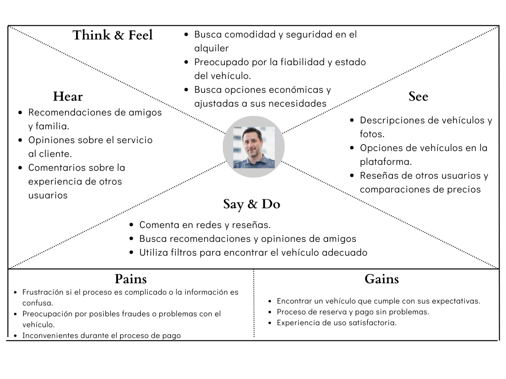
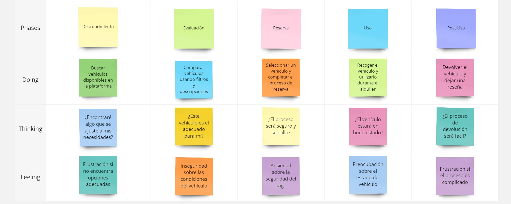
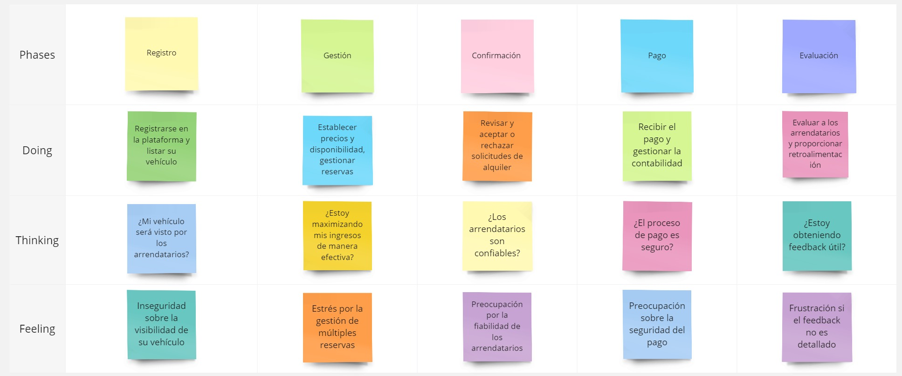

## Capítulo II: Requirements Elicitation & Analysis
### 2.1. Competidores
Después de nuestra investigación exhaustiva, hemos identificado dos empresas que ofrecen servicios similares a los nuestros y podrían representar competencia directa en nuestro sector. Al realizar este análisis competitivo, nuestro objetivo es obtener una comprensión completa del panorama en el que operamos. Esto nos permitirá tomar decisiones estratégicas informadas para diferenciarnos y destacarnos en un entorno dinámico y competitivo.

- Getaround: es una plataforma de movilidad compartida, fundada en 2009, que conecta propietarios de automóviles con personas que desean alquilar vehículos. Con sede en San Francisco, ofrece una amplia variedad de autos, desde económicos hasta de lujo, y se destaca por su enfoque en tecnología, seguridad e innovación. Los usuarios pueden gestionar el alquiler a través de su aplicación móvil, facilitando un acceso flexible y conveniente al transporte.

- UFODRIVE es una empresa fundada en 2018 que ofrece alquiler de vehículos eléctricos a través de una plataforma digital. Con sede en Luxemburgo, se enfoca en una experiencia de movilidad sostenible y sin complicaciones, permitiendo a los usuarios gestionar todo el proceso de alquiler desde una aplicación móvil. UFODRIVE destaca por su innovación y compromiso con la sostenibilidad, ofreciendo vehículos eléctricos modernos y estaciones de carga integradas.
  
- Hertz es una de las mayores compañías de alquiler de vehículos del mundo, fundada en 1918. Ofrece una amplia gama de autos, desde económicos hasta de lujo, y se destaca por su extensa red de sucursales y su enfoque en la calidad del servicio al cliente. Recientemente, ha invertido en vehículos eléctricos y tecnología avanzada para mejorar la experiencia de los usuarios.

#### 2.1.1. Análisis competitivo
<table>
    <tr>
      <th colspan="7" valign="top"><b>Competitive Analysis Landscape</b></th>
    </tr>
    <tr>
      <td colspan="2" rowspan="2">¿Por qué llevar a cabo este análisis?</td>
      <td colspan="5">Escriba en el recuadro la pregunta que busca responder o el objetivo de este análisis.</td>
    </tr>
    <tr>
      <td colspan="5">Este análisis se realizó con la finalidad de poder identificar a nuestros potenciales competidores e idear estrategias y tácticas para diferenciarnos de estos.</td>
    </tr>
    <tr>
      <td colspan="3">(En la cabecera colocar por cada competidor nombre y logo)</td>
      <td colspan="1" valign="top" style="font-weight: bold;">
          SpeedyRent
           
          

                  
          

      <td colspan="1" valign="top" style="font-weight: bold;">
        Getaround
      

                  
          

      </td>
      <td colspan="1" valign="top" style="font-weight: bold;">
        UFODrive 
        

                  
              

        </td>
      <td colspan="1" valign="top" style="font-weight: bold;" >
        Hertz
        

                  
              

      </td>
    </tr>
    <tr>
      <td colspan="1" rowspan="2">
Perfil
</td>
      <td colspan="2">Overview</td>
      <td colspan="1" valign="top">Aplicación que simplifica el alquiler de vehículos, garantizando seguridad y comodidad al verificar identidades, antecedentes y el estado de los vehículos, y promoviendo el uso de autos eléctricos.</td>
      <td colspan="1" valign="top">Aplicación que permite a los propietarios compartir sus vehículos con su enfoque innovador y tecnológico.</td>
      <td colspan="1" valign="top">Aplicación que ofrece alquiler de vehículos eléctricos con un proceso totalmente digital y sin contacto, enfocada en sostenibilidad.</td>
      <td colspan="1" valign="top">Aplicación de una compañía tradicional de alquiler de autos que ha integrado vehículos eléctricos y tecnología avanzada para mejorar el servicio al cliente.<td>
    </tr>
    <tr>
      <td colspan="2">Ventaja competitiva</td>
      <td colspan="1" valign="top">Optimiza el proceso de alquiler de vehículos al permitir a arrendadores y arrendatarios encontrar las mejores opciones según sus necesidades. Garantiza seguridad y comodidad mediante un riguroso filtro de seguridad que verifica identidades, antecedentes y el estado de los vehículos, promoviendo el uso de autos eléctricos para reducir la huella de carbono.</td>
      <td colspan="1" valign="top">Ofrece acceso flexible a una amplia gama de vehículos mediante una plataforma que permite alquilar autos entre personas. Al optimizar la utilización de vehículos subutilizados, proporciona a los clientes una variedad de opciones según sus necesidades y preferencias, brindando comodidad y seguridad mientras reduce la congestión vial y fomenta una economía colaborativa.</td>
      <td colspan="1" valign="top">Ofrece una experiencia de alquiler de vehículos eléctricos completamente digital y sin contacto. Su plataforma simplifica el proceso de alquiler mediante una aplicación móvil, proporcionando a los clientes comodidad y una alternativa sostenible al transporte convencional. Esto les permite disfrutar de una movilidad más ecológica con facilidad y eficiencia.</td>
      <td colspan="1" valign="top">Ofrece una amplia selección de vehículos y una extensa red de sucursales a nivel global. Al invertir en tecnología avanzada y vehículos eléctricos, proporciona a los clientes una experiencia de alquiler confiable y de alta calidad, con conveniencia y flexibilidad en la elección de autos, lo que mejora la experiencia general del servicio.</td>
    </tr>
    <tr>
      <td colspan="1" rowspan="2">
Perfil de Marketing
</td>
      <td colspan="2">Mercado objetivo</td>
      <td colspan="1" valign="top">Público en general mayor de 18 años que busca un proceso de alquiler de vehículos simplificado y seguro.      
      Ideal para arrendadores que desean monetizar sus vehículos y arrendatarios que necesitan opciones flexibles y confiables para satisfacer sus necesidades de transporte. Especialmente atractivo para personas interesadas en opciones sostenibles, ya que la plataforma promueve el uso de vehículos eléctricos para reducir la huella de carbono.</td>
      <td colspan="1" valign="top">Público en general mayor de 18 años que busca opciones flexibles y económicas para alquilar vehículos por cortos períodos. Ideal para personas que necesitan un auto de forma ocasional y propietarios interesados en monetizar vehículos subutilizados.</td>
      <td colspan="1" valign="top">Clientes conscientes del medio ambiente y entusiastas de la tecnología que prefieren alquilar vehículos eléctricos. Enfocado en personas que buscan una experiencia de alquiler completamente digital y sostenible.</td>
      <td colspan="1" valign="top">Viajeros y empresas que necesitan alquilar vehículos de manera confiable y flexible, incluyendo opciones de lujo y económicas. Atrae a clientes que valoran una extensa red de sucursales y tecnología avanzada en su experiencia de alquiler.</td>
    </tr>
    <tr>
      <td colspan="2">Estrategias de marketing</td>
      <td colspan="1" valign="top">Se destaca por su proceso de alquiler ágil y seguro mediante una plataforma web fácil de usar. Promocionamos la verificación rigurosa de identidades y el mantenimiento de vehículos para garantizar la seguridad y comodidad. También enfatizamos nuestro compromiso con la sostenibilidad, promoviendo vehículos eléctricos para reducir la huella de carbono. Utilizamos campañas digitales y colaboraciones con socios tecnológicos y ecológicos para atraer a clientes que buscan una experiencia de alquiler eficiente y ecológica.</td>
      <td colspan="1" valign="top">Centrarse en resaltar su enfoque en la sostenibilidad y la colaboración. Utilizan campañas de concienciación sobre la reducción de emisiones y la movilidad compartida para atraer a usuarios preocupados por el medio ambiente.</td>
      <td colspan="1" valign="top">Centrarse en la conveniencia y la variedad de opciones de alquiler. Destacan la facilidad de compartir coches y resaltan cómo su plataforma permite a los usuarios elegir entre una amplia gama de vehículos para adaptarse a sus necesidades.</td>
      <td colspan="1" valign="top">Enfocarse en la autenticidad y la personalización de la experiencia de alquiler. Resaltan la diversidad de vehículos disponibles en su plataforma, desde modelos convencionales hasta opciones de lujo y exóticas.</td>
    </tr>
    <tr>
      <td colspan="1" rowspan="3">
Perfil de Producto
</td>
      <td colspan="2">Productos & Servicios</td>
      <td colspan="1" valign="top">Ofrece una plataforma de alquiler de vehículos que facilita la conexión entre arrendadores y arrendatarios, garantizando la seguridad y comodidad del usuario mediante la verificación de identidad, antecedentes y el estado de los vehículos, y promoviendo el uso de autos eléctricos para reducir la huella de carbono.</td>
      <td colspan="1" valign="top">Ofrece una plataforma de alquiler de vehículos entre particulares, permitiendo a los propietarios compartir sus coches cuando no los utilizan, y facilitando la gestión de reservas y pagos.</td>
      <td colspan="1" valign="top">Ofrece un servicio de alquiler de autos 100% eléctricos con una experiencia digital completa, desde la reserva hasta la devolución del vehículo, con soporte 24/7.</td>
      <td colspan="1" valign="top">Ofrece una amplia gama de vehículos en alquiler, desde autos económicos hasta de lujo, con opciones de alquiler a corto y largo plazo, además de servicios adicionales como programas de lealtad y recogida en ubicaciones convenientes.</td>
    </tr>
    <tr>
      <td colspan="2">Precios & Costos</td>
      <td colspan="1" valign="top">La aplicación es totalmente gratuita. </td>
      <td colspan="1" valign="top">La aplicación es totalmente gratuita. </td>
      <td colspan="1" valign="top">La aplicación es totalmente gratuita. </td>
      <td colspan="1" valign="top">La aplicación es totalmente gratuita. </td>
    </tr>
    <tr>
      <td colspan="2">Canales de distribución (Web y/o Móvil)</td>
      <td colspan="1" valign="top"> El canal de distribución es Web</td>
      <td colspan="1" valign="top"> Los canales de distribución son digitales, como La App Store y Google Play.</td>
      <td colspan="1" valign="top"> Los canales de distribución son digitales, como La App Store y Google Play.</td>
      <td colspan="1" valign="top"> Los canales de distribución son digitales, como La App Store y Google Play.</td>
    </tr>
    <tr>
      <td colspan="1" rowspan="5">
Análisis SWOT
</td>
      <td colspan="6">Realice esto para su startup y sus competidores. Sus fortalezas deberían apoyar sus oportunidades y contribuir a lo que ustedes definen como su posible ventaja competitiva.</td>
    </tr>
    <tr>
      <td colspan="2">Fortalezas</td>
      <td colspan="1" valign="top">Al operar en una plataforma en línea permitiendo un acceso rápido. El sistema de verificación de identidad y antecedentes garantiza la confianza y seguridad de los usuarios. </td>
      <td colspan="1" valign="top">Optimiza el uso de vehículos subutilizados, reduciendo la congestión del tráfico y brindando una solución a los problemas de estacionamiento en áreas urbanas. </td>
      <td colspan="1" valign="top">Destaca por su enfoque en la innovación tecnológica, ofreciendo una experiencia de alquiler completamente digital y sin contacto físico. Su plataforma facilita un proceso de alquiler ágil y eficiente a través de una app, lo que atrae a usuarios que valoran la tecnología y la comodidad.</td>
      <td colspan="1" valign="top">Se beneficia de un fuerte reconocimiento de marca y una larga trayectoria en el mercado de alquiler de vehículos, lo que le otorga una ventaja en términos de confianza y lealtad del cliente. Su amplia red de oficinas y disponibilidad de vehículos en numerosas ubicaciones globales le permite atender una gran cantidad de clientes en diferentes regiones.</td>
    </tr>
    <tr>
      <td colspan="2">Debilidades</td>
      <td colspan="1" valign="top">La dependencia de la tecnología para la gestión de reservas y verificaciones puede ser una debilidad si se presentan fallos técnicos o problemas de conectividad. Speedy Rent también necesita construir una base crítica de usuarios para asegurar el éxito de la plataforma, y puede enfrentar costos asociados con la verificación de usuarios y el mantenimiento de vehículos eléctricos.</td>
      <td colspan="1" valign="top">Su éxito depende en gran medida de la densidad de usuarios y propietarios en una ubicación determinada.</td>
      <td colspan="1" valign="top">Se encuentra su cobertura geográfica limitada en comparación con competidores más grandes. Su enfoque en la tecnología también implica una dependencia significativa de la aplicación, lo que significa que cualquier fallo en la tecnología o problemas con la app pueden afectar negativamente la experiencia del usuario. </td>
      <td colspan="1" valign="top">Hertz enfrenta desafíos relacionados con su estructura tradicional, que depende de una red física y puede ser menos eficiente en comparación con modelos digitales completamente integrados. Sus tarifas de alquiler también pueden ser más altas en comparación con competidores más nuevos o plataformas que ofrecen precios más competitivos, lo que podría afectar su atractivo para algunos clientes.</td>
    </tr>
    <tr>
      <td colspan="2">Oportunidades</td>
      <td colspan="1" valign="top">Implementar programas de recompensas incentiva a los usuarios a utilizar repetidamente la plataforma. Ofrecer descuentos por reservas frecuentes o recompensas por referir a otros usuarios puede impulsar el crecimiento.</td>
      <td colspan="1" valign="top">Expandirse a nuevas ciudades y regiones puede aumentar su base de usuarios.</td>
      <td colspan="1" valign="top">tiene varias oportunidades para crecer en el mercado. El aumento en la demanda de vehículos eléctricos y la preocupación por la sostenibilidad pueden abrir nuevas oportunidades de mercado para la plataforma. Además, la evolución continua de la tecnología presenta oportunidades para mejorar aún más la experiencia del usuario y la eficiencia operativa. También existen posibilidades para establecer asociaciones estratégicas con empresas tecnológicas y sostenibles, lo que podría fortalecer su posición en el mercado.</td>
      <td colspan="1" valign="top">Tiene varias oportunidades para mejorar y expandir su negocio. La digitalización de sus servicios puede ofrecer una experiencia más conveniente y moderna a sus clientes, alineándose con las tendencias tecnológicas actuales. La incorporación de más vehículos eléctricos en su flota puede mejorar su imagen de sostenibilidad y atraer a clientes interesados en opciones ecológicas.</td>
    </tr>
    <tr>
      <td colspan="2">Amenazas</td>
      <td colspan="1" valign="top">La competencia de plataformas establecidas en el sector de alquiler de vehículos y carsharing puede ser una amenaza significativa. Además, los cambios en la regulación y políticas gubernamentales relacionadas con el alquiler de vehículos y la movilidad eléctrica podrían afectar la operación de Speedy Rent. También existe el riesgo de fluctuaciones en la demanda de vehículos eléctricos y la necesidad de mantener la infraestructura adecuada para soportar la plataforma.</td>
      <td colspan="1" valign="top">Incidentes de seguridad, como accidentes graves o problemas de delincuencia relacionados con vehículos compartidos, podrían dañar la reputación y la confianza de los usuarios.</td>
      <td colspan="1" valign="top">Enfrenta amenazas como la competencia de empresas establecidas en el mercado de alquiler de vehículos, que pueden ofrecer precios más competitivos o una mayor variedad de vehículos. Además, los cambios en la regulación de vehículos eléctricos y alquileres podrían impactar su modelo de negocio, lo que requiere una adaptación constante para mantenerse al día con las normativas.</td>
      <td colspan="1" valign="top">Se enfrenta a amenazas de nuevos entrantes en el mercado, como startups tecnológicas y plataformas innovadoras que pueden ofrecer servicios más modernos o a precios más bajos.</td>
    </tr>
</table>

#### 2.1.2. Estrategias y tácticas frente a competidores

Las estrategias y tácticas que aplicaremos para capitalizar nuestras fortalezas y oportunidades, al mismo tiempo que abordamos las debilidades y amenazas que presentan nuestros competidores, son las siguientes:

- **Simplificación y Agilización del Proceso de Alquiler:**
Speedy Rent se enfocará en ofrecer una experiencia de alquiler sencilla y rápida para los usuarios. Nuestra plataforma contará con una interfaz de usuario intuitiva que guiará a los usuarios paso a paso, desde la búsqueda del automóvil hasta la confirmación de la reserva, asegurando un proceso libre de complicaciones.

- **Atención al Cliente de Primera Calidad:**
En Speedy Rent, el servicio al cliente es una prioridad. Implementaremos un servicio de chat en línea en tiempo real dentro de la plataforma, permitiendo a los usuarios hacer preguntas y resolver problemas al instante. Esto garantizará que nuestros usuarios se sientan apoyados en todo momento, mejorando su experiencia general.

- **Foco en la Seguridad y Confianza:**
La seguridad de nuestros usuarios es fundamental en Speedy Rent. Todos los propietarios y arrendatarios deberán pasar por un proceso de verificación riguroso, que incluirá la presentación de documentación válida para confirmar su identidad. Además, realizaremos controles exhaustivos de antecedentes para asegurar que solo personas confiables formen parte de nuestra comunidad, estableciendo así un entorno seguro y de confianza para todos.

### 2.2. Entrevistas
#### 2.2.1. Diseño de entrevistas
* Segmento objetivo 1: Arrendatarios  
  Son aquellas personas que desean alquilar un vehículo por un período específico. 
    * Preguntas generales:   
      * **¿Cuál es su nombre completo?**  
      * **¿Cuántos años tienes?**  
      * **¿En que distrito reside?**  
      * **¿A qué se dedicas?**  

   * Preguntas antes de mencionar la propuesta: 
     * **¿Qué aspectos valoras más cuando eliges un servicio de alquiler de vehículos?**  
     * **¿Cómo te aseguras de que el vehículo que alquilas esté en buen estado?**  
     * **¿Qué problemas has enfrentado en el pasado con el alquiler de vehículos?**  
     * **¿Qué características te gustaría ver en una plataforma de alquiler de vehículos?**  
     * **¿Qué te haría sentir más seguro al alquilar un vehículo?**  
   * Preguntas luego de contarle sobre la Plataforma SpeedyRent:  
     * **¿Cómo te parece el enfoque de seguridad que ofrece Speedy Rent para los arrendatarios?**  
     * **¿Qué opinas sobre la verificación de antecedentes y estado del vehículo como parte del proceso de alquiler?**  
     * **¿Cómo crees que la promoción de vehículos eléctricos en nuestra plataforma podría influir en tu decisión de alquiler?**  
     * **¿Qué otras funcionalidades te gustarían ver en nuestra plataforma para mejorar tu experiencia?**  
     * **¿Qué aspectos de nuestra propuesta te parecen más atractivos y por qué?**  

* Segmento objetivo 2: Arrendadores  
  Son aquellas personas que poseen un vehículo y lo pone a disposición de un arrendatario a cambio de un pago.  
    * Preguntas generales:   
      * **¿Cuál es su nombre completo?**  
      * **¿Cuántos años tienes?**  
      * **¿En que distrito reside?**  
      * **¿A qué se dedicas?**  

   * Preguntas antes de mencionar la propuesta: 
     * **¿Qué desafíos enfrentas al intentar alquilar tu vehículo a través de plataformas existentes?**  
     * **¿Qué factores consideras más importantes al elegir una plataforma para listar tu vehículo?**  
     * **¿Cómo verificas la fiabilidad de los arrendatarios?**  
     * **¿Qué características o servicios te gustaría que ofreciera una plataforma de alquiler de vehículos?**  
     * **¿Qué tipo de soporte esperas recibir de una plataforma para asegurar una experiencia positiva?**  
   * Preguntas luego de contarle sobre la Plataforma SpeedyRent:  
     * **¿Cómo valoras la transparencia y las medidas de seguridad que ofrece Speedy Rent para listar tu vehículo?**  
     * **¿Qué opinas sobre el proceso de verificación de arrendatarios y vehículos que proponemos?**  
     * **¿Cómo te parece el enfoque de promover vehículos eléctricos en nuestra plataforma?**  
     * **¿Qué características adicionales te gustaría que implementáramos para hacer nuestra plataforma más útil para ti?**  
     * **¿Qué opinas del soporte que ofrecemos para asegurar una experiencia de alquiler segura y confiable?**  

#### 2.2.2. Registro de entrevistas

**Segmento Objetivo 2: Arrendador**

*Entrevistado 1*

<table border="1" style="text-align: left;">
	<tbody>
		<tr>
			<td colspan="1" rowspan="6"></td>
            <td colspan="1" rowspan="1"><strong>Nombre del entrevistado:
             
            </strong> Lucia
              Fernadez
            </td>
		</tr>
        <tr>
            <td>
            <strong>Edad: </strong> 24 años
             
            </td>
        </tr>
        <tr>
            <td>
            <strong>Distrito:</strong> 
             Estados Unidos
            </td>
        </tr>
        <tr>
            <td>
            <strong>Nombre del entrevistador:</strong>
             Samuel Ignacio
             Valera Garcés
            </td>
        </tr>
        <tr>
            <td>
            <strong>Timming: </strong>
             0:03 
            <strong>Duración: </strong>
             06:13:00
            </td>
        </tr>
        <tr>
            <td>
             <strong><a href="https://upcedupe-my.sharepoint.com/:v:/g/personal/u202111952_upc_edu_pe/EUVXUgrZ9y9MsBMIHeOQKPcB_XURnMBKetjKihTAeKO-ag?e=KhLX3s&nav=eyJyZWZlcnJhbEluZm8iOnsicmVmZXJyYWxBcHAiOiJTdHJlYW1XZWJBcHAiLCJyZWZlcnJhbFZpZXciOiJTaGFyZURpYWxvZy1MaW5rIiwicmVmZXJyYWxBcHBQbGF0Zm9ybSI6IldlYiIsInJlZmVycmFsTW9kZSI6InZpZXcifX0%3D">URL Entrevista</a></strong>
            </td>
        </tr>        
	</tbody>
</table>

Resumen: 
Lucia es una diseñadora que vive en Estados Unidos desde hace dos años que ganó el sorteo de un carro cuando vivía en Perú. Ha tenido dificultades al intentar alquilar su vehículo en plataformas existentes, principalmente debido a la falta de información clara sobre los arrendatarios y problemas en las transacciones. Valora la transparencia y la seguridad en las plataformas de alquiler, especialmente cuando se trata de una comunicación directa y accesible en caso de problemas. Lucia considera importante un proceso de verificación riguroso para arrendadores y arrendatarios, así como la promoción del uso de vehículos eléctricos, lo que considera beneficioso para el medio ambiente.    

**Segmento Objetivo 1: Arrendatario**

*Entrevistado 2*

<table border="1" style="text-align: left;">
	<tbody>
		<tr>
			<td colspan="1" rowspan="6"></td>
            <td colspan="1" rowspan="1"><strong>Nombre del entrevistado:
             
            </strong> Carla Paola
              Taype
            </td>
		</tr>
        <tr>
            <td>
            <strong>Edad: </strong> 26 años
             
            </td>
        </tr>
        <tr>
            <td>
            <strong>Distrito:</strong> 
             Jesús María
            </td>
        </tr>
        <tr>
            <td>
            <strong>Nombre del entrevistador:</strong>
             George Aldo
             Galvan Cerron
            </td>
        </tr>
        <tr>
            <td>
            <strong>Timming: </strong>
             0:13 
            <strong>Duración: </strong>
             6:10
            </td>
        </tr>
        <tr>
            <td>
             <strong><a href="https://upcedupe-my.sharepoint.com/personal/u20211e417_upc_edu_pe/_layouts/15/stream.aspx?id=%2Fpersonal%2Fu20211e417%5Fupc%5Fedu%5Fpe%2FDocuments%2Fentrevista%5Farrendatario%2Emp4&referrer=StreamWebApp%2EWeb&referrerScenario=AddressBarCopied%2Eview%2Ecf7cb133%2D8431%2D431d%2D8b1b%2Dc5e5b36e2a25">URL Entrevista</a></strong>
            </td>
        </tr>        
	</tbody>
</table>

Resumen: 
Carla Taype de 26 años es una arrendataria que destaca la importancia de la seguridad en el proceso de alquiler de vehículos. Para ella, es fundamental que tanto el propietario como el arrendatario tengan todos los papeles en orden, lo que incluye documentos de identidad y comprobantes de propiedad y seguro del vehículo. Carla menciona que sentirse segura y respaldada es clave para tener una buena experiencia. Otro aspecto que Carla valora enormemente es la calificación de los usuarios en la plataforma. Confía en el sistema de valoraciones para seleccionar los vehículos y los propietarios más confiables, y cree que es una herramienta esencial para mantener la calidad del servicio. Además, sugiere que la plataforma podría ofrecer garantías adicionales, como la verificación de antecedentes de los usuarios, para elevar aún más el nivel de seguridad. Finalmente, Carla señala que un buen servicio al cliente por parte de la plataforma es crucial, especialmente si surge algún inconveniente durante el alquiler. Para ella, la posibilidad de recibir asistencia rápida y eficiente genera confianza y asegura que repetiría la experiencia en el futuro.

**Segmento Objetivo 1: Arrendatario**

*Entrevistado 3*

<table border="1" style="text-align: left;">
	<tbody>
		<tr>
			<td colspan="1" rowspan="6"></td>
            <td colspan="1" rowspan="1"><strong>Nombre del entrevistado:
             
            </strong> Andrea
              Estrada
            </td>
		</tr>
        <tr>
            <td>
            <strong>Edad: </strong> 25 años
             
            </td>
        </tr>
        <tr>
            <td>
            <strong>Distrito:</strong> 
             Los Olivos
            </td>
        </tr>
        <tr>
            <td>
            <strong>Nombre del entrevistador:</strong>
             Fabiola Dayane
             Becerra Llempen
            </td>
        </tr>
        <tr>
            <td>
            <strong>Timming: </strong>
             0:14 
            <strong>Duración: </strong>
             4:44
            </td>
        </tr>
        <tr>
            <td>
             <strong><a href="https://upcedupe-my.sharepoint.com/:v:/g/personal/u20171a518_upc_edu_pe/EdUYe06ErA1DsuCwPWFvyK8Bxc7fQtoE7U89MZrbG6NLhQ?e=WElwF0&nav=eyJyZWZlcnJhbEluZm8iOnsicmVmZXJyYWxBcHAiOiJTdHJlYW1XZWJBcHAiLCJyZWZlcnJhbFZpZXciOiJTaGFyZURpYWxvZy1MaW5rIiwicmVmZXJyYWxBcHBQbGF0Zm9ybSI6IldlYiIsInJlZmVycmFsTW9kZSI6InZpZXcifX0%3D">URL Entrevista</a></strong>
            </td>
        </tr>        
	</tbody>
</table>

Resumen: 
Andrea Estrada es ingeniera de software y vive en Perú, en el distrito de Los Olivos. Nos comenta que valora las reseñas y que los costos de los vehículos sean razonables. Anteriormente, tuvo problemas con la falta de claridad en los costos adicionales. Le gustaría que hubiera una verificación previa del auto para saber si es seguro y conocer el costo real. También le gustaría contar con atención al cliente. Se sentiría más segura si en la plataforma pudiera observar que el vehículo ha pasado por un control de seguridad.

Andrea nos comenta que le parece interesante nuestra aplicación porque nos enfocamos en la calidad y seguridad de los vehículos. Le agrada la idea de los arrendamientos que ofrecemos en la plataforma. Además, considera una buena opción la verificación de antecedentes e identificación del vehículo, ya que le garantiza obtener un auto seguro. Le gustaría ver reseñas de usuarios anteriores que alquilaron a través de la aplicación, junto con beneficios o descuentos para usuarios frecuentes. Para ella, la seguridad es lo más importante para decidirse a ser usuaria de la aplicación.

**Segmento Objetivo 1: Arrendatarios**

*Entrevistado 4*

<table border="1" style="text-align: left;">
	<tbody>
		<tr>
			<td colspan="1" rowspan="6"></td>
            <td colspan="1" rowspan="1"><strong>Nombre del entrevistado:
             
            </strong> Maria Yesenia
              Alva Leyva
            </td>
		</tr>
        <tr>
            <td>
            <strong>Edad: </strong> 45 años
             
            </td>
        </tr>
        <tr>
            <td>
            <strong>Distrito:</strong> 
             Los Olivos
            </td>
        </tr>
        <tr>
            <td>
            <strong>Nombre del entrevistador:</strong>
             Maria Fernanda
             Fernandez Alva
            </td>
        </tr>
        <tr>
            <td>
            <strong>Timming: </strong>
             0:12 
            <strong>Duración: </strong>
             6:14
            </td>
        </tr>
        <tr>
            <td>
             <strong><a href="https://upcedupe-my.sharepoint.com/:v:/g/personal/u20211e417_upc_edu_pe/EWVOMyZ3_xtPiEyUdPjjMsABKw1aN2Q_u7MS5OMEI2BeXA?nav=eyJyZWZlcnJhbEluZm8iOnsicmVmZXJyYWxBcHAiOiJPbmVEcml2ZUZvckJ1c2luZXNzIiwicmVmZXJyYWxBcHBQbGF0Zm9ybSI6IldlYiIsInJlZmVycmFsTW9kZSI6InZpZXciLCJyZWZlcnJhbFZpZXciOiJNeUZpbGVzTGlua0NvcHkifX0&e=2kdMvI">URL Entrevista</a></strong>
            </td>
        </tr>        
	</tbody>
</table>

Resumen: 
María Yesenia Alva Leyva, con poca experiencia en el alquiler de vehículos, valora principalmente la facilidad de uso de la plataforma, un proceso rápido y sencillo, y el precio. Para asegurar que el vehículo esté en buen estado, confía en plataformas con buena reputación. Ha enfrentado problemas como vehículos no limpios y procesos de reserva complicados con largas esperas. Prefiere características como una sección de preguntas frecuentes y considera esencial un contrato claro con derechos y deberes especificados, así como un seguro para el auto. María encuentra positivo el enfoque de seguridad de Speedy Rent, considera importante la verificación de antecedentes y estado del vehículo, y aunque la promoción de vehículos eléctricos no influye mucho en su decisión actual, podría ser relevante en el futuro. También sugiere incluir comparaciones de precios en la plataforma y valora la seguridad y facilidad de uso como los aspectos más atractivos.

**Segmento Objetivo 2: Arrendador**

*Entrevistado 5*

<table border="1" style="text-align: left;">
	<tbody>
		<tr>
			<td colspan="1" rowspan="6"></td>
            <td colspan="1" rowspan="1"><strong>Nombre del entrevistado:
             
            </strong> Renso Anthony
              Julca Cruz
            </td>
		</tr>
        <tr>
            <td>
            <strong>Edad: </strong> 20 años
             
            </td>
        </tr>
        <tr>
            <td>
            <strong>Distrito:</strong> 
             Carabayllo
            </td>
        </tr>
        <tr>
            <td>
            <strong>Nombre del entrevistador:</strong>
             Fiorella Angela
             Vilca Valverde
            </td>
        </tr>
        <tr>
            <td>
            <strong>Timming: </strong>
             0:12 
            <strong>Duración: </strong>
             6:06
            </td>
        </tr>
        <tr>
            <td>
             <strong><a href="https://upcedupe-my.sharepoint.com/:v:/g/personal/u20211e417_upc_edu_pe/EbXFCqDplwJJlxdY9NiKFEEBov_4C0f2Or38q9z38Ere5g?nav=eyJyZWZlcnJhbEluZm8iOnsicmVmZXJyYWxBcHAiOiJPbmVEcml2ZUZvckJ1c2luZXNzIiwicmVmZXJyYWxBcHBQbGF0Zm9ybSI6IldlYiIsInJlZmVycmFsTW9kZSI6InZpZXciLCJyZWZlcnJhbFZpZXciOiJNeUZpbGVzTGlua0NvcHkifX0&e=VySt1h">URL Entrevista</a></strong>
            </td>
        </tr>        
	</tbody>
</table>

Resumen: 
Renso mencionó sus principales desafíos al alquilar (seguridad del vehículo y confianza en los arrendatarios), los factores importantes al elegir una plataforma (seguridad, facilidad de uso, y alcance), cómo verifica la fiabilidad (opiniones de usuarios y verificaciones rigurosas), y las características deseadas en una plataforma (seguro para el vehículo, asistencia en emergencias, tarifas justas). Espera soporte 24/7 y rápida resolución de disputas.

Después de la propuesta, destacó la valoración de la transparencia y seguridad de Speedy Rent, el proceso de verificación propuesto para arrendatarios y vehículos, la promoción de vehículos eléctricos como positiva, la solicitud de servicios adicionales de mantenimiento, y la importancia del soporte efectivo para mejorar la experiencia de alquiler.

**Segmento Objetivo 2: Arrendador**

*Entrevistado 6*

<table border="1" style="text-align: left;">
	<tbody>
		<tr>
			<td colspan="1" rowspan="6"></td>
            <td colspan="1" rowspan="1"><strong>Nombre del entrevistado:
             
            </strong> Sebastian
              Ramirez
            </td>
		</tr>
        <tr>
            <td>
            <strong>Edad: </strong> 23 años
             
            </td>
        </tr>
        <tr>
            <td>
            <strong>Distrito:</strong> 
             La Victoria
            </td>
        </tr>
        <tr>
            <td>
            <strong>Nombre del entrevistador:</strong>
             George Aldo
             Galvan Cerron
            </td>
        </tr>
        <tr>
            <td>
            <strong>Timming: </strong>
             0:18 
            <strong>Duración: </strong>
             7:06
            </td>
        </tr>
        <tr>
            <td>
             <strong><a href="https://upcedupe-my.sharepoint.com/personal/u20211e417_upc_edu_pe/_layouts/15/stream.aspx?id=%2Fpersonal%2Fu20211e417%5Fupc%5Fedu%5Fpe%2FDocuments%2Fentrevista%5Farrendador%2Emkv&referrer=StreamWebApp%2EWeb&referrerScenario=AddressBarCopied%2Eview%2Eda91eebe%2Da485%2D4dcb%2Dba65%2D0de170c092d6">URL Entrevista</a></strong>
            </td>
        </tr>        
	</tbody>
</table>

Resumen: 
Sebastián Ramírez es un joven emprendedor que alquila su vehículo cuando, por falta de tiempo, no puede usarlo o para generar ingresos adicionales. Sebastián nos comenta que la característica principal que busca al confiar su vehículo a otra persona es la confiabilidad, y que esta persona pueda demostrarlo presentando documentos personales que acrediten su identidad. No pretende alquilar el vehículo a un precio excesivo, ya que su objetivo es hacerlo accesible para una mayor cantidad de personas, y asegura que siempre lo mantiene en condiciones óptimas, con revisiones regulares y limpieza constante. Además, nos menciona que valora mucho que la plataforma ofrezca un "plus" a los dueños de vehículos como él, que se esfuerzan en mantener sus autos en perfectas condiciones para la comodidad de los usuarios que decidan alquilarlos. Sebastián también sugiere que la plataforma podría implementar un sistema de calificación y recompensas para aquellos propietarios que reciben buenas valoraciones, lo cual incentivaría a más dueños a cuidar sus vehículos y a brindar un mejor servicio. Finalmente, destaca que una buena experiencia para ambas partes no solo depende del estado del vehículo, sino también de la transparencia y seguridad en todo el proceso de alquiler, asegurando que tanto el propietario como el arrendatario se sientan tranquilos y satisfechos con la transacción.

#### 2.2.3. Análisis de entrevistas
**Segmento Objetivo: Arrendador**
- **Seguridad y Verificación:** Los arrendadores destacan la importancia de la seguridad de sus vehículos y valoran un proceso de verificación riguroso para arrendatarios. La transparencia y confianza son esenciales, y muchos sugieren que la plataforma debería incluir recompensas para aquellos que mantengan sus vehículos en óptimas condiciones.

- **Mantenimiento y Soporte:** El buen estado de los vehículos es prioritario, y se espera que la plataforma ofrezca soporte 24/7 y asistencia en caso de problemas. La promoción de vehículos eléctricos es vista positivamente, aunque no es determinante para todos.

**Segmento Objetivo: Arrendatarios**
- **Seguridad y Confianza:** Los arrendatarios priorizan la seguridad, confiando en sistemas de calificación y verificación para seleccionar vehículos y propietarios. Es crucial que la plataforma sea transparente en costos y fácil de usar.

- **Atención al Cliente:** Un buen servicio al cliente es vital para resolver cualquier inconveniente durante el alquiler. Los arrendatarios también valoran la posibilidad de revisar opiniones de usuarios anteriores para tomar decisiones informadas.

- **Sostenibilidad:** Aunque no es un factor decisivo, algunos arrendatarios aprecian que la plataforma promueva el uso de vehículos eléctricos, lo que podría atraer a usuarios preocupados por la sostenibilidad.

### 2.3. Needfinding
#### 2.3.1. User Personas
* Segmento objetivo 1: Arrendatario  
  Son aquellas personas que desean alquilar un vehículo por un período específico. 
  
   
* Segmento objetivo 2: Arrendadores  
  Son aquellas personas que poseen un vehículo y lo pone a disposición de un arrendatario a cambio de un pago.   
    

#### 2.3.2. User Task Matrix
* Segmento objetivo 1: Arrendatario  
  Son aquellas personas que desean alquilar un vehículo por un período específico. 
 
 <table align="center">
    <thead>
      <tr>
        <td rowspan="2"></td>
        <th colspan="2">User Persona</th>
      </tr>
      <tr>
        <td colspan="2">Daniel Rodriguez   (Segmento Objetivo 1: Arrendatario) </td>
      </tr>
      <tr>
        <td>Task</td>
        <td>Frecuency</td>
        <td>Importance</td>
      </tr>
    </thead>
    <tbody>
      <tr>
        <td>Buscar vehículos disponibles para alquilar.	 
        <td>High </td>
        <td>High</td>
      </tr>
      <tr>
        <td>Filtrar vehículos por tipo, ubicación y   características.
        <td>Medium </td>
        <td>High</td>
      </tr>
      <tr>
        <td>Ver detalles y fotos de un vehículo en   particular </td>
        <td>High</td>
        <td>High</td>
      </tr>
      <tr>
        <td>Reservar un vehículo para una fecha y hora  específicas  </td>
        <td>Medium</td>
        <td>Medium</td>
      </tr>
      <tr>
        <td>Comunicarse con el arrendador para   coordinar la recogida y entrega. </td>
        <td>High  </td>
        <td>High </td>
      </tr>
      <tr>
        <td>Cancelar una reserva si es necesario.  </td>
        <td>Medium</td>
        <td>High</td>
      </tr>
      <tr>
        <td>Revisar el estado del vehículo antes de la   entrega.</td>
        <td>Medium</td>
        <td>High</td>
      </tr>
      <tr>
        <td>Dejar una reseña y calificación  después del alquiler.  </td>
        <td>Low</td>
        <td>High</td>
      </tr>
    </tbody>
  </table>

* Segmento objetivo 2: Arrendadores  
  Son aquellas personas que poseen un vehículo y lo pone a disposición de un arrendatario a cambio de un pago.

 <table align="center">
    <thead>
      <tr>
        <td rowspan="2"></td>
        <th colspan="2">User Persona</th>
      </tr>
      <tr>
        <td colspan="2">María Lopez   (Segmento Objetivo 2: Arrendador) </td>
      </tr>
      <tr>
        <td>Task</td>
        <td>Frecuency</td>
        <td>Importance</td>
      </tr>
    </thead>
    <tbody>
      <tr>
        <td>Listar su vehículo en la plataforma para alquilar. 
        <td>High </td>
        <td>High</td>
      </tr>
      <tr>
        <td>Agregar detalles y fotos precisas del vehículo. 
        <td>High </td>
        <td>High</td>
      </tr>
      <tr>
        <td>Establecer disponibilidad y tarifas para el alquiler. 
        <td>Medium</td>
        <td>Medium</td>
      </tr>
      <tr>
        <td>Responder a consultas y mensajes de arrendatarios. </td>
        <td>Medium</td>
        <td>High</td>
      </tr>
      <tr>
        <td>Recibir pagos por alquiler del vehículo. </td>
        <td>High  </td>
        <td>High </td>
      </tr>
      <tr>
        <td>Dejar una reseña y calificación después del alquiler. </td>
        <td>Low</td>
        <td>Mediun</td>
      </tr>
      <tr>
        <td>Gestionar la disponibilidad y condiciones de sus vehículos  </td>
        <td>Medium</td>
        <td>High</td>
      </tr>
      <tr>
        <td>Verificar el estado de los vehículos.  </td>
        <td>Medium</td>
        <td>High</td>
      </tr>
    </tbody>
  </table>

#### 2.3.3. User Journey Mapping
* Segmento objetivo 1: Arrendatario  
  Son aquellas personas que desean alquilar un vehículo por un período específico.
  
   
* Segmento objetivo 2: Arrendadores  
  Son aquellas personas que poseen un vehículo y lo pone a disposición de un arrendatario a cambio de un pago.
  

#### 2.3.4. Empathy Mapping
* Segmento objetivo 1: Arrendatario  
  Son aquellas personas que desean alquilar un vehículo por un período específico.
  
* Segmento objetivo 2: Arrendadores  
  Son aquellas personas que poseen un vehículo y lo pone a disposición de un arrendatario a cambio de un pago.   
   

#### 2.3.5. As-is Scenario Mapping
* Segmento objetivo 1: Arrendatario  
  Son aquellas personas que desean alquilar un vehículo por un período específico.
  
   
* Segmento objetivo 2: Arrendadores  
  Son aquellas personas que poseen un vehículo y lo pone a disposición de un arrendatario a cambio de un pago.   
  

### 2.4. Ubiquitous Language
* Usuario (User): Persona que utiliza la plataforma "Speedy Rent" para alquilar o arrendar automóviles. Se clasifica en dos categorías:

  - Arrendador (Owner): Usuario que ofrece su automóvil para alquiler en la plataforma.
  - Arrendatario (Renter): Usuario que busca alquilar un automóvil a través de la plataforma.

- Automóvil (Car): Vehículo disponible para alquiler en la plataforma, exclusivamente automóviles.

- Perfil del Automóvil (Car Profile): Información detallada del automóvil ofrecido para alquiler, que incluye marca, modelo, tipo de vehículo, características, estado de mantenimiento y historial de revisiones.

- Registro de Usuario (User Registration): Proceso mediante el cual los usuarios se registran en la plataforma, incluyendo la verificación de identidad y antecedentes.

- Estado del Automóvil (Car Condition): Descripción y verificación del estado físico y funcional del automóvil antes de ser listado en la plataforma, garantizando que cumple con los estándares de seguridad.

- Entrega y Devolución del Automóvil (Car Delivery/Return): Proceso de transferencia del automóvil del propietario al arrendatario al inicio del alquiler y su retorno al final del período acordado.

- Tarifa de Alquiler (Rental Fee): Precio que el arrendatario paga al propietario por el uso del automóvil durante un período específico.

- Planes de Alquiler (Rental Plans): Diferentes opciones disponibles para propietarios y arrendatarios, que ofrecen beneficios y servicios adicionales basados en la frecuencia de uso o duración del alquiler.

- Pago (Payment): Método y proceso a través del cual se realiza la transacción financiera por el alquiler del automóvil y cualquier plan adicional.

- Filtro de Seguridad (Security Filter): Mecanismo que verifica la identidad, antecedentes y reputación de los usuarios y automóviles antes de permitir su participación en la plataforma.

- Automóviles Eléctricos (Electric Cars): Automóviles que funcionan con energía eléctrica, promovidos en la plataforma como una opción sostenible que contribuye a la reducción de la huella de carbono.

- Soporte al Cliente (Customer Support): Servicio disponible 24/7 para asistir a los usuarios en cualquier problema o consulta durante el proceso de alquiler.

- Sistema de Calificación (Rating System): Mecanismo que permite a propietarios y arrendatarios calificarse mutuamente, ayudando a mantener un alto nivel de confianza y seguridad en la plataforma.