## Capítulo V: Product Implementation, Validation & Deployment
### 5.1. Software Configuration Management
#### 5.1.1. Software Development Environment Configuration
En esta sección, detallaremos las plataformas y el software que utilizamos como equipo para el desarrollo y la gestión de nuestro startup. Estas herramientas nos permiten optimizar procesos, colaborar de manera eficiente y asegurar el crecimiento sostenible de nuestro proyecto.  
**Project Management**  [Discord](https://discord.com/) y [WhatsApp](https://www.whatsapp.com/?lang=es) han sido los medios principales de comunicación entre los miembros del grupo, donde Discord ha destacado ya que contiene funcionalidades adicionales para organizar grupos de estudio y de trabajo.  
**Requirements Management**  Hemos utilizado [Trello](https://trello.com/home) como herramienta principal para la organización y gestión de tareas. En Trello, creamos listas específicas para las etapas del trabajo, como “Entregables”, "Por Hacer", "En Proceso", "Pendiente de Revisión" y "Completado". Cada lista contiene tarjetas que representan tareas individuales asignadas a los miembros del equipo, permitiendo un seguimiento claro del progreso y facilitando la colaboración.  Además, empleamos Google Drive para crear un documento compartido donde todos los miembros del equipo pueden agregar y revisar sus contribuciones. Este documento sirve como la versión central del trabajo, garantizando que todos puedan verificar la precisión y la coherencia de las partes antes de integrarlas en el formato Markdown final para la entrega.
 
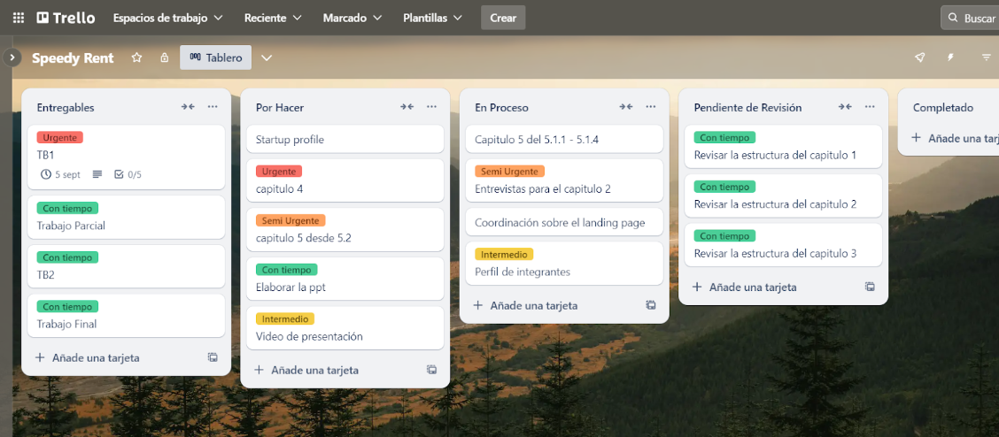

**Product UX/UI Design**<ul><li><strong>UXPressia:</strong> Se utilizó <a href="https://uxpressia.com/">UXPressia</a> para el desarrollo de los diagramas user personas, user journey mapping, empathy mapping e impact map.</li><li><strong>Color Space:</strong> Se utilizó <a href="https://mycolor.space/">Color Space</a> ha apoyado en la selección de la paleta de colores para el desarrollo del diseño de la web.</li><li><strong>Figma:</strong> Se ha utilizado <a href="https://www.figma.com/">Figma</a> para el desarrollo de los wireframes y prototipos del landing page y aplicación web, tanto en dispositivos de escritorio como de móvil.</li><li><strong>Miro:</strong> Se utilizó <a href="https://miro.com/es/">Miro</a> para el desarrollo de los escenarios mapping y escenario mapping para ambos segmentos objetivos.</li></ul>

**Software Development** <ul>
<li><a href="https://code.visualstudio.com/">Visual Studio Code</a>, <a href="https://visualstudio.microsoft.com/es/vs/community/">Visual Studio Code Community</a> e <a href="https://www.jetbrains.com/idea/">IntelliJ IDEA</a> fueron las IDEs que emplearemos para el desarrollo del código del proyecto. Hemos desarrollado el landing page con Visual Studio Code, luego Visual Studio Code Community para el diagrama C4 y emplearemos IntelliJ IDEA para la aplicación web.</li>
  <li><a href="https://github.com/">Github</a> y <a href="https://git-scm.com/downloads">Git bash</a> nos permitirán el control de versiones del código y el desarrollo colaborativo del proyecto.</li>
</ul>

**Software Testing**
  Para la fase de pruebas, planeamos utilizar [Postman](https://www.postman.com/) como nuestra herramienta principal para la verificación y validación de las API que serán desarrolladas en la etapa de programación. Una vez que el backend esté implementado, realizaremos pruebas manuales de los endpoints para asegurarnos de que las solicitudes (GET, POST, PUT, DELETE) funcionen correctamente y devuelvan las respuestas esperadas.  
**Software Deployment**  [Github Pages](https://github.com/) Se utilizó Github Pages para el deploy del landing page. Se ha utilizado [Firebase](https://firebase.google.com/?hl=es) para desplegar el Frontend a través de su funcionalidad de hosting.  
**Software Documentation** <ul>
<li><strong>Google Drive:</strong> Se ha utilizado <a href="https://www.google.com/intl/es-419_pe/drive/">Google Drive</a> para subir archivos de documentos y presentación. Además, se han utilizado herramientas como Google Docs y Google Slides que permiten el desarrollo colaborativo de los informes a entregar.</li><li><strong>Google Meets y Zoom:</strong> Se ha utilizado <a href="https://meet.google.com/">Google Meets</a> y <a href="https://zoom.us/">Zoom</a> para videoconferencias y realizar las entrevistas de segmentos objetivos. Las plataformas tienen herramientas de grabación, lo que simplifica el procesamiento de los videos.</li><li><strong>Microsoft Stream:</strong> Se ha utilizado el servicio de <a href="https://www.microsoft.com/es-ww/microsoft-365/microsoft-stream">Microsoft Stream</a> para subir el video completo de las entrevistas. La cuenta que ha subido el video está vinculada a la organización de la universidad, lo que permitió tener suficiente espacio de memoria en la nube.</li><li><strong>LucidChart:</strong> <a href="https://www.lucidchart.com/pages/es">LucidChart</a> ha sido empleado en el desarrollo de diagramas de flujo para asegurar los user goals y guiar en el diseño de los prototipos de la aplicación web. Además, se ha utilizado para el diagrama de clases.</li><li><strong>Structurizr:</strong> Para el desarrollo del diagrama C4 en los tres niveles (diagrama de contexto, contenedores y componentes), se empleó <a href="https://structurizr.com/">Structurizr</a> junto a Visual Studio Code Community.</li><li><strong>Vertabelo:</strong> Para el desarrollo del diagrama del diseño de base de datos, se ha empleado <a href="https://vertabelo.com/">Vertabelo</a>, software especializado en diagramas de base de datos.</li></ul>

#### 5.1.2. Source Code Management
Se ha creado una organización en Github con los miembros del grupo y un repositorio para el landing page.

|Segmento                          |        URL                        |
|--------------------------------- | --------------------------------- |
|Organización|https://github.com/SpeedyRent|
|Repositorio Landing Page| https://github.com/SpeedyRent/SpeedyRent-LandingPage |
|Despliegue del Landing Page | https://speedyrent.github.io/SpeedyRent-LandingPage/ |
|Frontend | https://github.com/SpeedyRent/SpeedyRent-Frontend |
|Despliegue del Frontend | https://speedy-rent-19f82.web.app/ |
|Backend| https://github.com/SpeedyRent/SpeedyRent-Backend |

**GitFlow Implementation** GitFlow es un modelo estructurado para gestionar el desarrollo y las ramas en Git. Las ramas principales en este flujo son develop y main. La rama develop actúa como la principal rama de trabajo donde se integran nuevas características, mientras que la rama main contiene la versión estable y lista para producción, que se despliega en GitHub Pages. Además, se crean ramas adicionales para cada tarea o funcionalidad específica que se esté desarrollando, garantizando un flujo organizado y controlado.
 
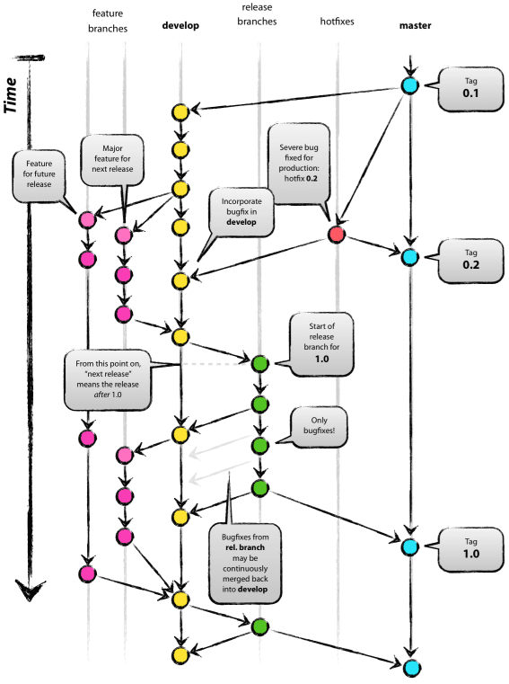

  **Feature Branches** Cada nueva funcionalidad se desarrolla en su propia rama individual, creada a partir de develop. Estas ramas permiten aislar el trabajo en progreso y facilitan la integración de nuevas características sin interrumpir el desarrollo principal.
 

  **Release Branches** Las ramas de lanzamiento se crean desde develop cuando se prepara una nueva versión para ser enviada a producción. Estas ramas permiten pulir detalles finales antes de fusionar la versión en main y lanzar el producto.
 

  **Hotfix Branches** Las ramas de hotfix se utilizan para solucionar errores críticos que aparecen en producción. Se crean desde main y, una vez resuelto el problema, se fusionan tanto en main como en develop, garantizando que el arreglo esté presente en las futuras versiones de desarrollo.
 

  **Semantic versioning** Los releases se realizan según los estándares de Semantinc Versioning 2.0 (https://semver.org/), según el formato MAJOR.MINOR.PATCH. 
- **MAJOR:** Versión mayor cuando se implementa cambios de APIs incompatibles.
- **MINOR:** versión menor cuando se añaden features y funcionalidades nuevas.
- **PATCH:** versión de parche de bug fixes y hotfixes. 

**Conventional Commits** En GitHub, se sigue el estándar de commits convencionales versión 1.1.0 (Conventional Commits 1.1.0). Este sistema organiza los mensajes de commit de forma clara y estructurada, facilitando la comprensión y el seguimiento de cambios. La convención se basa en la siguiente estructura:
 

- **Type:** Representa el tipo de commit, sea tipo feature (feat), fix (fix) o docs (docs).
- **Optional scope:** Es opcional y representa el alcance del commit.
- **Description:** Descripción detallada del commit y acciones realizadas.

#### 5.1.3. Source Code Style Guide & Conventions
Como convención general , todo el codigo realizado por los miembros del equipo debe redactarse en completo inglés.
  **HTML** 
- **Use Lowercase Element Name** 
Se recomienda usar lowercase para los nombres de los elementos HTML: 
 
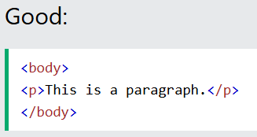
 
- **Close All HTML Elements** 
Se recomienda cerrar todos los elementos HTML: 
 

 
- **Use Lowercase Attribute Names** 
Se recomienda usar lowercase para los nombres de los atributos HTML: 
 

 
- **Always Specify alt, width, and height for Images** 
Se recomienda seguir estas convenciones en caso de que la imagen no se puede mostrar y ayudar con la accesibilidad del contenido: 
 

 Para mas información sobre las convenciones de HTML: https://www.w3schools.com/html/html5_syntax.asp

 **CSS**  
- **ID and Class Naming** 
Usar nombres de clases y ID significativos que expresen el propósito del elemento: 
 

 
- **Block Content Identation** 
Sangrar todo el contenido del bloque, es decir, reglas dentro de reglas, así como declaraciones, para reflejar la jerarquía y Mejorar la comprensión 
 

 
- **Section Comments** 
Agrupe las secciones de la hoja de estilo mediante comentarios. Separar secciones con nuevas líneas. 
 

 Para mas informacion sobre las convenciones de CSS: https://google.github.io/styleguide/htmlcssguide.html

 **JavaScript**  
- **Array initializers: can be "block-like"** 
Cualquier inicializador de matriz puede ser formateado opcionalmente como si fuera un "tipo bloque" construir". Por ejemplo, los siguientes son todos válidos (no es un análisis exhaustivo lista): 
 
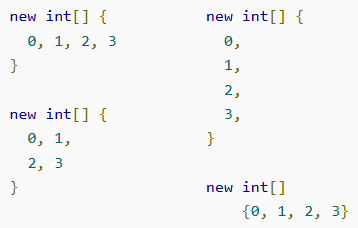
 
- **Type-use annotations** 
Las anotaciones de uso de tipo aparecen inmediatamente antes del tipo anotado. Una anotación es un uso de tipo anotación si está meta-anotado con . Ejemplo:@Target(ElementType.TYPE_USE) 
 

 
- **Method and constructor annotations** 
Las reglas para las anotaciones en las declaraciones de método y constructor son las mismas que en la sección anterior. Ejemplo: 
 

 Para mas informacion sobre las convenciones de JavaScript: https://google.github.io/styleguide/javaguide.html

 **TypeScript**  
- **Imports** 
Hay cuatro variantes de instrucciones de importación en ES6 y TypeScript: 
 
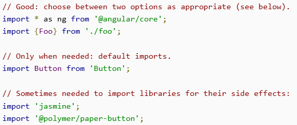
 
- **Class declarations** 
Las declaraciones de clase no deben terminar con punto y coma: 
 

 
- **Constructors** 
Las llamadas al constructor deben usar paréntesis, incluso cuando no se pasa ningún argumento: 
 
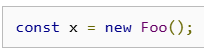

 Para mas informacion sobre las convenciones de TypeScript: https://google.github.io/styleguide/tsguide.html

 **Gherkin**  
- **Discernible Given-When-Then Blocks** 
En teoría, sus escenarios pueden ser tan simples como un solo paso Given, When Then, cada uno. Sin embargo, en la vida real, tienden a crecer y tienen múltiples pasos para cada una de estas palabras clave. Para detectar rápidamente dónde termina un bloque y comienza otro, puede sangrar los pasos que comienzan con "Y". Entonces, el escenario sería algo así: 
 

 
Una alternativa es hacer que cada paso comience con la misma sangría y agregar una nueva línea adicional antes del siguiente bloque de palabras clave.  
- **Steps with Tables** 
A menudo usamos tablas en nuestros pasos. Para que sea inmediatamente reconocible que un paso necesita más información de una tabla, usamos dos puntos al final del paso. Esto ayuda cuando se usa IntelliSense, que no incluye vistas previas de tablas, pero mostrará los dos puntos: 
 

 
- **Reducing Noise** 
Para reducir el ruido, se recomienda utilizar valores predeterminados para los campos que el sistema requiere, pero que no son relevantes para su escenario. 
 

 
Para mas informacion sobre las convenciones de Gherkin: https://specflow.org/gherkin/gherkin-conventions-for-readable-specifications/

### 5.1.4. Software Deployment Configuration
En esta sección, abordaremos el despliegue de nuestra Landing Page mediante el servicio automatizado en la nube de GitHub Pages. A continuación, se describirán los pasos para lograr este objetivo. 

1. Es crucial asegurarnos de que el repositorio esté configurado correctamente, ya que posteriormente lo desplegaremos con GitHub Pages: 

2. Accedemos al Github Pages: 

3. Después de haber establecido nuestro repositorio, procedemos a asignar las primeras 4 “User Stories" entre los miembros del equipo para llevar a cabo el desarrollo de nuestra Landing Page. Además, creamos ramas individuales (main, develop) según sea necesario. Esto permitió que cada miembro trabajara de manera eficiente sin conflictos 

4.	Visualizamos los commits respectivos que se hicieron en el landing pages. 

5. Una vez que hayamos guardado la configuración, GitHub Pages iniciará el proceso de despliegue de nuestra Landing Page. Aquí podremos seguir el proceso de despliegue y, una vez que se complete con éxito, se generará un enlace que nos permitirá acceder a nuestra Landing Page. 
 

 
Link de referencia: https://speedyrent.github.io/LandingPage-SpeedyRent.github.io/

## 5.2. Landing Page, Services & Applications Implementation

### 5.2.1. Sprint 1

#### 5.2.1.1 Sprint Planning 1

Para este primer sprint nos enfocaremos en los tasks para la
elaboración de la Landing Page. Nos dividiremos entre nosotros cada
una de las tareas identificadas para el sprint.
<table>
<tr>
    <th colspan="5">Sprint #</th>
    <th colspan="9">Sprint 1</th>
  </tr>
      <tr>
    <td colspan="13">Sprint Planning Background</td>
  </tr>
  <tr>
    <td colspan="5">Date</td>
    <td colspan="8">2024-08-19</td>
</tr>
  <tr>
    <td colspan="5">Time</td>
    <td colspan="8">11:30 PM</td>
  </tr>
  <tr>
    <td colspan="5">Location</td>
    <td colspan="8">Via Discord y Google Meet</td>
<tr>
    <td colspan="5">Prepared By</td>
    <td colspan="8">George</td>
</tr>
<tr>
    <td colspan="5">Attendees (to planning meeting)</td>
    <td colspan="8">George, Fabiola Dayane Becerra Llempen,Samuel Ignacio Valera Garces,Maria Fernanda Fernandez Alva,Paolo Eduardo Belleza Tello, Fiorella </td>
</tr>
<tr>
    <td colspan="5">Sprint n – 1 Review Summary</td>
    <td colspan="8">En esta seccion se planteo el desarrollo del landing page para nuestro proyecto llamado SpeedyRent y la reparticion de partes de caracter individual para esta primera entrega</td>
</tr>
<tr>
    <td colspan="5">Sprint n – 1 Retrospective Summary</td>
    <td colspan="8">En esta seccion todos los integrantes mencionaron tener aciertos en las respectivas partes que le correspondia cada uno para esta primera entrega</td>
</tr>
<tr>
    <td colspan="13">Sprint Goal & User Stories</td>
</tr>
<tr>
    <td colspan="5">Sprint n Goal</td>
    <td colspan="8">Culminar el landing Page e Informe</td>
</tr>
<tr>
    <td colspan="5">Sprint n Velocity</td>
    <td colspan="8">6 story points</td>
</tr>
<tr>
    <td colspan="5">Sum of Story Points</td>
    <td colspan="8">9 Story Points</td>
</tr>
</table>

### 5.2.1.2 Sprint Backlog 1

<table border="1">
  <tr>
    <th>Sprint</th>
    <th colspan="7">Sprint 1</th>
  </tr>
  <tr>
    <th colspan="2">User Story</th>
    <th colspan="6">Work-Item/Task</th>
  </tr>
  <tr>
    <th>Id</th>
    <th>Title</th>
    <th>Id</th>
    <th>Title</th>
    <th>Description</th>
    <th>Estimations (Hours)</th>
    <th>Assigned To</th>
    <th>Status (To-do/In-Process/To-Review/Done)</th>
  </tr>
  <tr>
    <td>US-001</td>
    <td>Guía del Proceso de Registro en el Landing Page</td>
    <td>TS-01</td>
    <td>Proceso de registro (Desarrollado en HTML, CSS y JS)</td>
    <td>Implementación del proceso de registro en la Landing Page, siguiendo los estándares "Responsive"</td>
    <td>10 Hours</td>
    <td>George y Samuel</td>
    <td>Done</td>
  </tr>
  <tr>
    <td>US-002</td>
    <td>Sección de beneficios</td>
    <td>TS-02</td>
    <td>Sección de Beneficios (Desarrollado en HTML)</td>
    <td>Implementación de la sección de Beneficio, realizando pruebas para detectar y corregir errores.</td>
    <td>7 Hours</td>
    <td>Paolo y Maria</td>
    <td>Done</td>
  </tr>
  <tr>
    <td>US-003</td>
    <td>Sección de vehículos destacados</td>
    <td>TS-03</td>
    <td>Sección de vehículos(Desarrollado en HTML, CSS y JS).</td>
    <td>Implementación de las funcionalidades , asegurándose de que todo esté correcto.</td>
    <td>10 Hours</td>
    <td>Fabiola y Fiorella</td>
    <td>Done</td>
  </tr>
  <tr>
    <td>US-004</td>
    <td>Sección de proceso de alquiler</td>
    <td>TS-04</td>
    <td>Sección del proceso de alquiler confirmado (Desarrollado en HTML, CSS y JS).</td>
    <td>Implementación de una página intuitiva y fácil de usar.</td>
    <td>8 Hours</td>
    <td>George</td>
    <td>Done</td>
  </tr>
</table>

### 5.2.1.3 Development Evidence for Sprint Review
| Repository         | Branch     | Commit Ids                                | Commit Message              | Commit Message Body          | Committed on (Date) |
|--------------------|------------|------------------------------------------|-----------------------------|------------------------------|---------------------|
| [medmeet-landing](#) | develop  | 609cfaea3f952d46fe4acb85bd6f739920b71c94 | feat: Landing Page Implementation |                              | 06/09/2024          |
|                    | develop  | daad621d150ad03181c9ccfe068afb1317d34722 | feat: images           |                              | 08/09/2023          |
|                    | develop  | acfdc5c50033e68b90833ef60b7b00a7682128e3  | feat: added correct forms             |                              | 08/09/2023          |
|                    | develop  | 66c069008956fce6a641a4411c5cda7cfe7915da | feat: css changes             |                              | 08/09/2023          |
|                    | develop  | bbc7fe45cfeef06c81f53f481a177e58d42f1b8c   | feat: index changes          |                              | 08/09/2023          |
|                    | develop  | d1e108d2d9b1d8a9271658ec0846e489aed3be5b | feat: Landing Page Final  |                              | 09/09/2023          |

### 5.2.1.4 Testing Suite Evidence for Sprint Review
### 5.2.1.5 Execution Evidence for Sprint Review
Para esta primera entrega, nuestro equipo a conseguido elaborar la Landing Page del proyecto "SpeedyRent". De tal modo, se podrá visualizar la información necesaria de lo que ofrece nuestro proyecto.

**Sección de inicio**: Se implementó el Header de nuestra Landing Page. 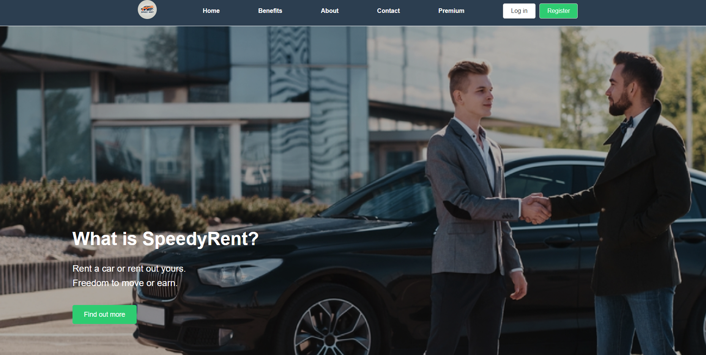
**Sección de Nosotros**: Se implementó la sección de nosotros.
 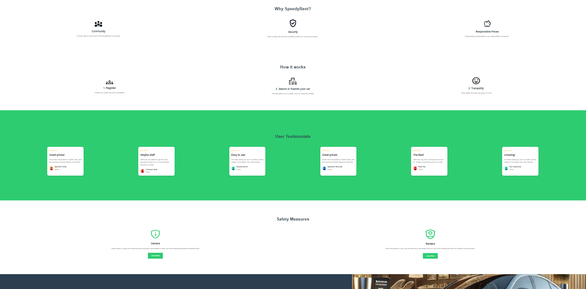
**Sección de Servicios**: Se implementó la sección de Safety Measures.
 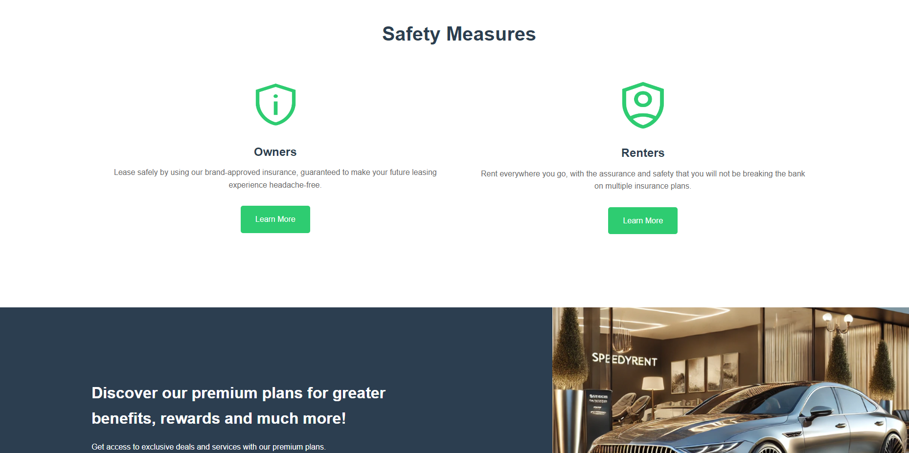
**Sección de Planes**: Se implementó la sección de ver los tipos de suscripción. 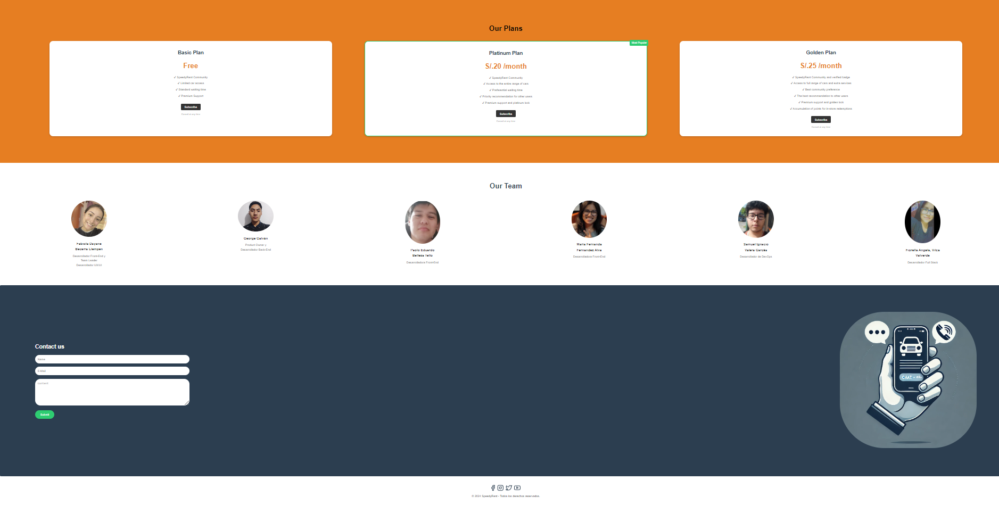 
**Sección de contacto y creadores**: Se añadió la sección de contacto para facilitar la comunicación con los usuarios y la información de los creadores.

### 5.2.1.6 Services Documentation Evidence for Sprint Review

En el alcance del presente sprint, no se han utilizado servicios de web ya que se ha trabajado solamente el landing page estático. Por lo tanto, en esta presentación no se encuentra documentación de web services empleados.

### 5.2.1.7. Software Deployment Evidence for Sprint Review
Para el despliegue de la landing page, utilizamos GitHub Pages. Esta herramienta nos permitió publicar la página web directamente desde el código almacenado en un repositorio. El enlace de acceso a la landing page es el siguiente: https://speedyrent.github.io/LandingPage-SpeedyRent.github.io/.

### 5.2.1.8 Team Collaboration Insights during Sprint

Para el desarrollo de este primer sprint, todos los miembros del equipo desarrollaron y colaboraron de manera activa y continua. De tal modo, se muestra como evidencia los insights de cada miembro del equipo.

Commits:

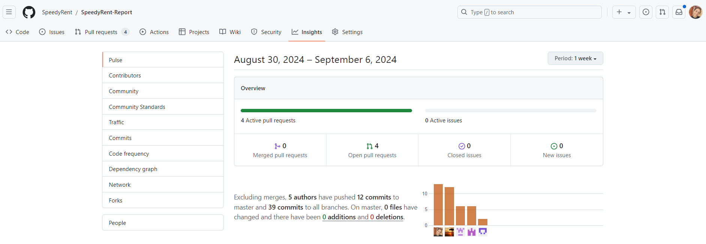

Analiticas de Colaboración:

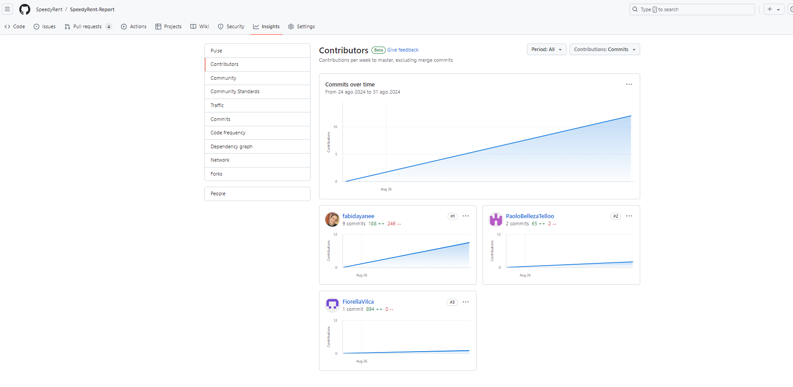

### 5.2.2. Sprint 2

#### 5.2.2.1 Sprint Planning 2

Para este primer sprint nos enfocaremos en los tasks para la
elaboración de la Landing Page. Nos dividiremos entre nosotros cada
una de las tareas identificadas para el sprint.
<table>
<tr>
    <th colspan="5">Sprint #</th>
    <th colspan="9">Sprint 2 </th>
  </tr>
      <tr>
    <td colspan="13">Sprint Planning Background</td>
  </tr>
  <tr>
    <td colspan="5">Date</td>
    <td colspan="8">2024-09-19</td>
</tr>
  <tr>
    <td colspan="5">Time</td>
    <td colspan="8">11:30 PM</td>
  </tr>
  <tr>
    <td colspan="5">Location</td>
    <td colspan="8">Via Discord y Google Meet</td>
<tr>
    <td colspan="5">Prepared By</td>
    <td colspan="8">George, Fabiola Dayane Becerra Llempen,Samuel Ignacio Valera Garces,Maria Fernanda Fernandez Alva,Paolo Eduardo Belleza Tello, Fiorella</td>
</tr>
<tr>
    <td colspan="5">Attendees (to planning meeting)</td>
    <td colspan="8">George, Fabiola Dayane Becerra Llempen,Samuel Ignacio Valera Garces,Maria Fernanda Fernandez Alva,Paolo Eduardo Belleza Tello, Fiorella </td>
</tr>
<tr>
    <td colspan="5">Sprint n – 2 Review Summary</td>
    <td colspan="8">En esta seccion se planteo el desarrollo del landing page para nuestro proyecto llamado SpeedyRent y la reparticion de partes de caracter individual para esta primera entrega</td>
</tr>
<tr>
    <td colspan="5">Sprint n – 2 Retrospective Summary</td>
    <td colspan="8">En esta seccion todos los integrantes mencionaron tener aciertos en las respectivas partes que le correspondia cada uno para esta primera entrega</td>
</tr>
<tr>
    <td colspan="13">Sprint Goal & User Stories</td>
</tr>
<tr>
    <td colspan="5">Sprint n Goal</td>
    <td colspan="8">Avanzar el trabajo en vue.js</td>
</tr>
<tr>
    <td colspan="5">Sprint n Velocity</td>
    <td colspan="8">6 story points</td>
</tr>
<tr>
    <td colspan="5">Sum of Story Points</td>
    <td colspan="8">9 Story Points</td>
</tr>
</table>

### 5.2.2.1. Sprint Backlog 2
En esta sección se presentan las tareas realizadas durante el presente sprint, acompañadas de una captura de pantalla de Trello y el enlace
correspondiente al tablero.
Link de Trello:

<table border="1">
  <tr>
    <th>Sprint</th>
    <th colspan="7">Sprint 2</th>
  </tr>
  <tr>
    <th colspan="2">User Story</th>
    <th colspan="6">Work-Item/Task</th>
  </tr>
  <tr>
    <th>Id</th>
    <th>Title</th>
    <th>Id</th>
    <th>Title</th>
    <th>Description</th>
    <th>Estimations (Hours)</th>
    <th>Assigned To</th>
    <th>Status (To-do/In-Process/To-Review/Done)</th>
  </tr>
  <tr>
    <td>US-005</td>
    <td>Proceso de Registro Seguro para Arrendadores </td>
    <td>TS-05</td>
    <td>User Bounded Context </td>
    <td>Implementación la busqueda de vehiculos </td>
    <td>4 Hours</td>
    <td>Fiorella Vilca</td>
    <td>Done</td>
  </tr>
  <tr>
    <td>US-006</td>
    <td>Proceso de Registro Seguro para Arrendatarios </td>
    <td>TS-06</td>
    <td>Sección de Beneficios (Desarrollado en HTML)</td>
    <td>Implementación de la sección de Beneficio, realizando pruebas para detectar y corregir errores.</td>
    <td>7 Hours</td>
    <td>GE</td>
    <td>Done</td>
  </tr>
  <tr>
    <td>US-007</td>
    <td>Postear y eliminar un vehiculo(Arrendador)</td>
    <td>TS-07</td>
    <td>Navegation system </td>
    <td>Implementación de las funcionalidades , asegurándose de que todo esté correcto.</td>
    <td>6 Hours</td>
    <td>Samuel Valera</td>
    <td>Done</td>
  </tr>
  <tr>
     <td>US-008</td>
    <td>Modificar parametros del vehiculo publicado(Arrendador)  </td>
    <td>TS-08</td>
    <td>Navegation system </td>
    <td>Implementación la busqueda de vehiculos </td>
    <td>3 Hours</td>
    <td>Samuel Valera</td>
    <td>Done</td>
  </tr>
    <tr>
   <td>US-009</td>
    <td>Filtro de búsqueda de vehículos para personas que desean alquilar </td>
    <td>TS-09</td>
    <td> Navegation system </td>
    <td>Implementación la busqueda de vehiculos </td>
    <td>3 Hours</td>
    <td>Fabiola Becerra</td>
    <td>Done</td>
  </tr>
      <tr>
   <td>US-010</td>
    <td>Mandar solicitud al Arrendador </td>
    <td>TS-10</td>
    <td>Fill out a form to send the request </td>
    <td>Two components, one to fill out the request fields and the other to view the requests </td>
    <td>30 Hours</td>
    <td>Maria Fernanda Fernandez Alva</td>
    <td>Done</td>
  </tr>
      <tr>
   <td>US-011</td>
    <td>Aceptar o rechazar solicitud del arrendatario (Arrendador) </td>
    <td>TS-11</td>
    <td>Request managed by the landlord </td>
    <td>Component with the functionality to accept or reject a vehicle </td>
    <td>48 Hours</td>
    <td>Paolo Eduardo Belleza Tello</td>
    <td>Done</td>
  </tr>
</table>

### 5.2.2.3 Development Evidence for Sprint Review
| Repository         | Branch     | Commit Ids                                | Commit Message              | Commit Message Body          | Committed on (Date) |
|--------------------|------------|------------------------------------------|-----------------------------|------------------------------|---------------------|
| [SpeedyRent-Frontend](https://github.com/SpeedyRent/SpeedyRent-Frontend)](#) | develop  | ae3b5f885949bf55cab9a0a8d8291622868ec714 | feat/Search-Vehicle-filters | Se creo la carpeta que tendra el contenido estable                             | 23/09/2024          |
|  [SpeedyRent-Frontend](https://github.com/SpeedyRent/SpeedyRent-Frontend)](#)             | develop  |ce9e232bc95b69682aca66137888559e5f3267f7  | add-edit-delete-vehicle         |                           Se creo la carpeta que tendra el contenido estable    | 23/09/2024          |
|[SpeedyRent-Frontend](https://github.com/SpeedyRent/SpeedyRent-Frontend)](#)                | develop  |a92b9913e1cfa0096a762cafd9f180330b9d6b1b   | feat/Send-request-tenant             |                          Se creo la carpeta que tendra el contenido estable     | 23/09/2024            |
| [SpeedyRent-Frontend](https://github.com/SpeedyRent/SpeedyRent-Frontend)](#)               | develop  | c97fab98cedd05983491f6dcd9ef98607f7023d5 | accept-reject-request-owner            |                          Se creo la carpeta que tendra el contenido estable     | 23/09/2024             |
|  [SpeedyRent-Frontend](https://github.com/SpeedyRent/SpeedyRent-Frontend)](#)              | develop  |  2597ea6983bfd30d2edff77197f98ddb76e49e6b  | feat/register-renter         |                          Se creo la carpeta que tendra el contenido estable     | 23/09/2024            |
|  [SpeedyRent-Frontend](https://github.com/SpeedyRent/SpeedyRent-Frontend)](#)              | develop  | 94c635ae977a59d14050f5b6c7eb1a592801015d | feat/login-owner  |                          Se creo la carpeta que tendra el contenido estable     | 23/09/2024           |

### 5.2.2.4 Testing Suite Evidence for Sprint Review
### 5.2.2.5 Execution Evidence for Sprint Review

En este Sprint (Sprint 2), nuestro equipo a conseguido elaborar el fronted del proyecto "SpeedyRent". De tal modo, se podrá visualizar la información necesaria de lo que ofrece nuestro proyecto.

**Sección de Registro Arrendadores**: Proceso de Registro Seguro para Arrendadores . 
**Sección de Registro Arrendatarios**: Proceso de Registro Seguro para Arrendatarios . 
**Sección de postear y eliminar vehiculo**: Postear y eliminar un vehiculo(Arrendador).
 
**Sección de modificar parametros**:  Modificar parametros del vehiculo publicado(Arrendador).  
**Sección de busqueda y filtro**: Como el usuario realiza la busqueda de vehiculo a rentar (Arrendatario).
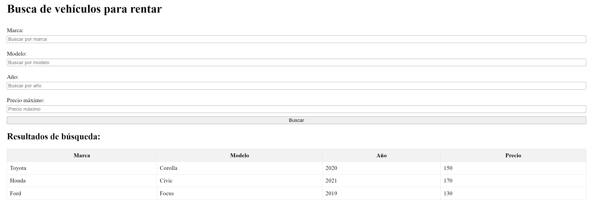
**Sección de solicitud**:Mandar solicitud para alquilar el vehiculo. 
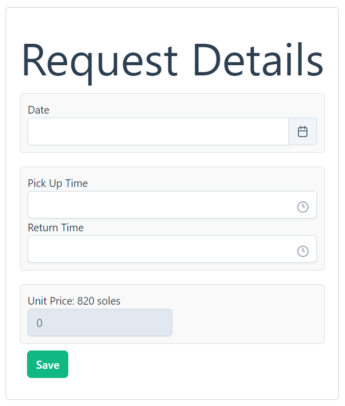
**Sección de aceptar y rechazar**: Aceptar o rechazar solicitud del arrendatario (Arrendador). 
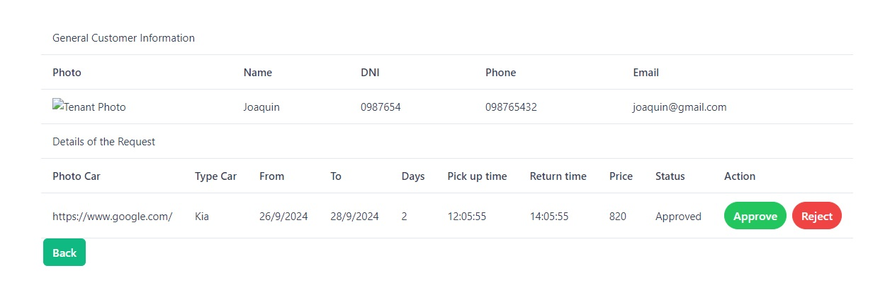

### 5.2.2.6 Services Documentation Evidence for Sprint Review

En el alcance del sprint 2, se ha dado prioridad al desarrollo del frontend de la aplicación web, lo que significa que en este sprint no se
observa la utilización de servicios web.

### 5.2.2.7. Software Deployment Evidence for Sprint Review
Durante este sprint, se ha completado el desarrollo del frontend de la aplicación web. Para el despliegue, se utilizaron las siguientes
herramientas.
Aquí está la lista ordenada:
Git: Sistema de control de versiones que utilizamos para trabajar de forma colaborativa y monitorear las versiones de la aplicación web
en un repositorio remoto.
Gitflow: Este flujo de trabajo colaborativo nos ha permitido dividir el trabajo en ramas dentro de nuestro repositorio, lo que facilita la
colaboración en el desarrollo.
GitHub: La plataforma que nos proporcionó la herramienta para crear nuestro repositorio y almacenar las versiones de nuestro
proyecto.
Netlify: Una plataforma que automatiza la implementación de sitios web estáticos, lo que nos permitió alojar y desplegar nuestra
aplicación web.

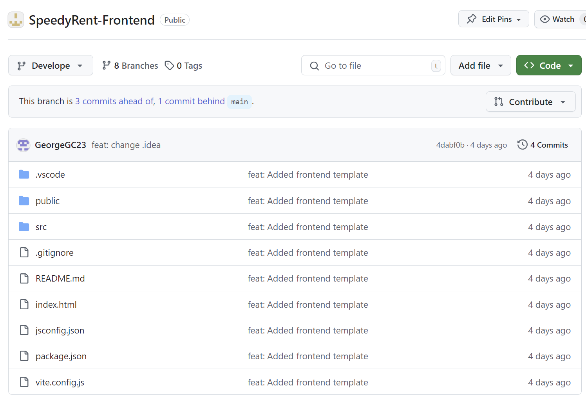 
### 5.2.2.8 Team Collaboration Insights during Sprint

Para el desarrollo de este sprint, todos los miembros del equipo desarrollaron y colaboraron de manera activa y continua. De tal modo, se muestra como evidencia los insights de cada miembro del equipo.

Commits:

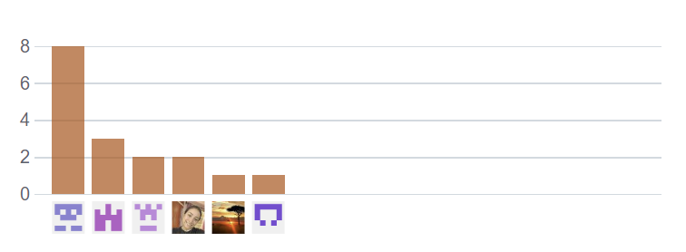

Analiticas de Colaboración:

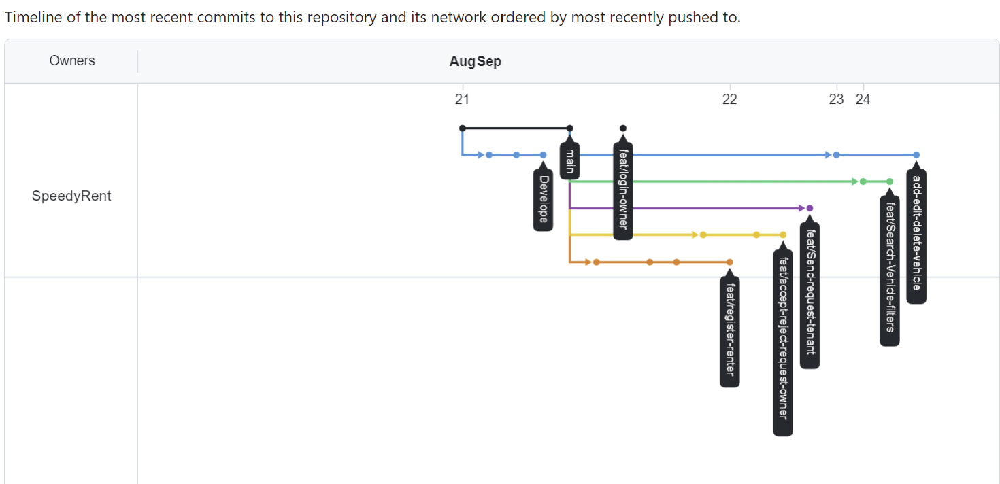

### 5.2.3 Sprint 3

#### 5.2.3.1 Sprint Planning 3

<table>
<tr>
    <th colspan="5">Sprint #</th>
    <th colspan="9">Sprint 3</th>
  </tr>
      <tr>
    <td colspan="13">Sprint Planning Background</td>
  </tr>
  <tr>
    <td colspan="5">Date</td>
    <td colspan="8">2024-11-1</td>
</tr>
  <tr>
    <td colspan="5">Time</td>
    <td colspan="8">17:30 horas (GMT)-5</td>
  </tr>
  <tr>
    <td colspan="5">Location</td>
    <td colspan="8">Google Meet</td>
<tr>
    <td colspan="5">Prepared By</td>
    <td colspan="8">Valera Garces, Samual Ignacio</td>
</tr>
<tr>
    <td colspan="5">Attendees (to planning meeting)</td>
    <td colspan="8">
    Valera Garces, Samual Ignacio 
	  Becerra Llempen, Fabiola Dayane 
	  Fernandez Alva, Maria Fernanda 
	  Belleza Tello, Paolo Eduardo 
	  Galván Cerrón, George Aldo 
	  Vilca Valverde, Fiorella Angela</td>
</tr>
<tr>
    <td colspan="5">Sprint n – 2 Review Summary</td>
    <td colspan="8">El equipo se organizó para elaborar y completar las últimas historias de usuario y abordar las observaciones del Trabajo Parcial en la fecha acordada, contando con la participación de dos integrantes. El mayor desafío fue realizar el cambio en el archivo db.json.</td>
</tr>
<tr>
    <td colspan="5">Sprint n – 2 Retrospective Summary</td>
    <td colspan="8">Se identificaron mejoras en la comunicación interna y en el proceso de gestión de tareas. Se propuso un esquema más claro para asignar tareas de frontend y backend y asegurar que cada integrante entienda las dependencias.</td>
</tr>
<tr>
    <td colspan="13">Sprint Goal & User Stories</td>
</tr>
<tr>
    <td colspan="5">Sprint 3 Goal</td>
    <td colspan="8">Avanzar en la implementación del backend en un 50%, incluyendo funcionalidades clave como el register, gestion de usuarios y configuracion de API</td>
</tr>
<tr>
    <td colspan="5">Sprint 3 Velocity</td>
    <td colspan="8">44 story points</td>
</tr>
<tr>
    <td colspan="5">Sum of Story Points</td>
    <td colspan="8">
    US-012    Selección de Vehículo para Alquiler (8 puntos) 
    US-013    Confirmación del Alquiler  (5 puntos) 
    US-014    Aceptación de Solicitud de Alquiler (5 puntos) 
    US-015    Rechazo de Solicitud de Alquiler (5 puntos) 
    US-016    Generación del Contrato (8 puntos) 
    US-017    Firma Digital del Contrato (8 puntos) 
    US-018    Selección del Método de Pago (5 puntos)</td>
</tr>
</table>

#### 5.2.3.2 Sprint Backlog 3

<table border="1">
  <tr>
    <th>Sprint</th>
    <th colspan="7">Sprint 3</th>
  </tr>
  <tr>
    <th colspan="2">User Story</th>
    <th colspan="6">Work-Item/Task</th>
  </tr>
  <tr>
    <th>Id</th>
    <th>Title</th>
    <th>Id</th>
    <th>Title</th>
    <th>Description</th>
    <th>Estimations (Hours)</th>
    <th>Assigned To</th>
    <th>Status (To-do/In-Process/To-Review/Done)</th>
  </tr>
  <tr>
    <td>EP-002</td>
    <td>Cuenta de usuario Arrendador</td>
    <td>EP-002</td>
    <td>Creation of user account data</td>
    <td>Implementación del backend</td>
    <td>5 Hours</td>
    <td>Samuel Valera</td>
    <td>Done</td>
  </tr>
  <tr>
    <td>EP-003</td>
    <td>Cuenta de usuario Arrendatario</td>
    <td>EP-003</td>
    <td>Creation of user account data</td>
    <td>Implementación del backend</td>
    <td>5 Hours</td>
    <td>Samuel Valera</td>
    <td>Done</td>
  </tr>
  <tr>
    <td>EP-002 y EP-003</td>
    <td>Cuenta de usuario</td>
    <td>EP-002 y EP-003</td>
    <td>User account data</td>
    <td>Implementación del backend</td>
    <td>5 Hours</td>
    <td>Galvan Cerron, George Aldo</td>
    <td>Done</td>
  </tr>
  <tr>
    <td>EP-006</td>
    <td>Busqueda de vehiculo a rentar</td>
    <td>EP-006</td>
    <td>Filtros de busqueda</td>
    <td>Implementación del backend</td>
    <td>4 Hours</td>
    <td>Fabiola Becerra</td>
    <td>Done</td>
  </tr>
  <tr>
    <td>EP-007</td>
    <td>Renta de vehiculo Pagina Principal</td>
    <td>EP-006</td>
    <td>Home Page de instrucciones para los usuarios</td>
    <td>Implementación del backend</td>
    <td>5 Hours</td>
    <td>Fiorella Vilca</td>
    <td>Done</td>
  </tr>
  <tr>
    <td>EP-012</td>
    <td>Selección de Vehículo para Alquiler</td>
    <td>TS-012</td>
    <td>Complete and Submit Rental Application</td>
    <td>Seleccionar un vehículo de la lista disponible y proceder con la solicitud de alquiler</td>
    <td>24 Hours</td>
    <td>Paolo Belleza Tello</td>
    <td>Done</td>
  </tr>
  <tr>
    <td>EP-013</td>
    <td>Confirmación del Alquiler</td>
    <td>TS-013</td>
    <td>Detailed View of the Rental Request</td>
    <td>Ver el detalle de la solicitud de alquiler con un estado</td>
    <td>24 Hours</td>
    <td>Maria Fernanda Fernandez Alva</td>
    <td>Done</td>
  </tr>
  <tr>
    <td>EP-014</td>
    <td>Aceptación de Solicitud de Alquiler</td>
    <td>TS-014</td>
    <td>Application Review and Acceptance</td>
    <td>Revisar y aceptar la solicitud de alquiler de un arrendatario para confirmar el alquiler del vehículo</td>
    <td>24 Hours</td>
    <td>Maria Fernanda Fernandez Alva</td>
    <td>Done</td>
  </tr>
  <tr>
    <td>EP-015</td>
    <td>Rechazo de Solicitud de Alquiler</td>
    <td>TS-015</td>
    <td>Application Review and Acceptance</td>
    <td>Rechazar la solicitud de alquiler de un arrendatario si no estoy de acuerdo con los términos o condiciones</td>
    <td>24 Hours</td>
    <td>Maria Fernanda Fernandez Alva</td>
    <td>Done</td>
  </tr>
  <tr>
    <td>EP-016</td>
    <td>Generación del Contrato</td>
    <td>TS-016</td>
    <td>Automatic contract generation</td>
    <td>Generar automáticamente un contrato legal cuando se acepte una solicitud de alquiler</td>
    <td>48 Hours</td>
    <td>Paolo Belleza Tello</td>
    <td>Done</td>
  </tr>
  <tr>
    <td>EP-017</td>
    <td>Firma Digital del Contrato</td>
    <td>TS-017</td>
    <td>Signing of the Contract by Both Parties</td>
    <td>Firmar digitalmente el contrato de alquiler para formalizar el acuerdo y garantizar que ambas partes acepten los términos y condiciones.</td>
    <td>48 Hours</td>
    <td>Paolo Belleza Tello</td>
    <td>Done</td>
  </tr>
  <tr>
    <td>EP-018</td>
    <td>Selección del Método de Pago</td>
    <td>TS-018</td>
    <td>Viewing Payment Options</td>
    <td>Seleccionar un método de pago</td>
    <td>48 Hours</td>
    <td>Maria Fernanda Fernandez Alva</td>
    <td>Done</td>
  </tr>
</table>

#### 5.2.3.3 Development Evidence for Sprint Review
| Repository         | Branch     | Commit Ids                                | Commit Message              | Commit Message Body                     | Committed on (Date) |
|--------------------|------------|------------------------------------------|-----------------------------|-----------------------------------------|---------------------|
| [SpeedyRent-Backend](https://github.com/SpeedyRent/SpeedyRent-Backend) | develop  | ae3b5f885949bf55cab9a0a8d8291622868ec714 | feat/login-register-back    | Se creó la carpeta que tendrá el contenido estable | 10/02/2024          |
| [SpeedyRent-Backend](https://github.com/SpeedyRent/SpeedyRent-Backend) | develop  | ce9e232bc95b69682aca66137888559e5f3267f7 | feat/homepage-research-back | Se creó la carpeta que tendrá el contenido estable | 10/02/2024          |
| [SpeedyRent-Backend](https://github.com/SpeedyRent/SpeedyRent-Backend) | develop  | a92b9913e1cfa0096a762cafd9f180330b9d6b1b | feat/user-account-back      | Se creó la carpeta que tendrá el contenido estable | 10/02/2024          |
| [SpeedyRent-Backend](https://github.com/SpeedyRent/SpeedyRent-Backend) | develop  | c97fab98cedd05983491f6dcd9ef98607f7023d5 | feat/homepage-community-back| Se creó la carpeta que tendrá el contenido estable | 10/02/2024          |

#### 5.2.3.5 Execution Evidence for Sprint Review
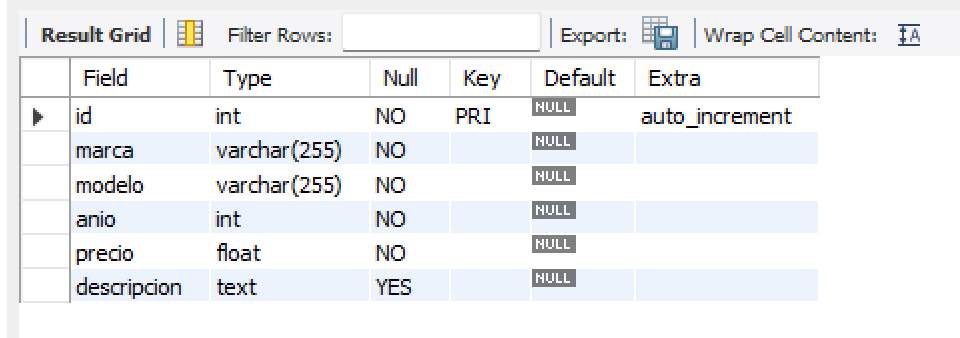
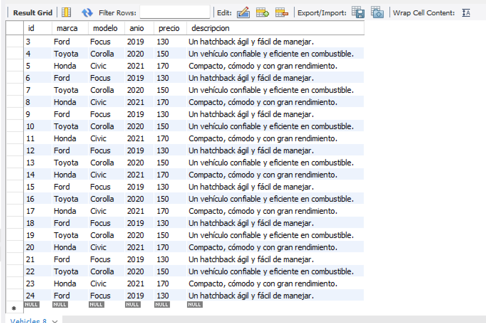

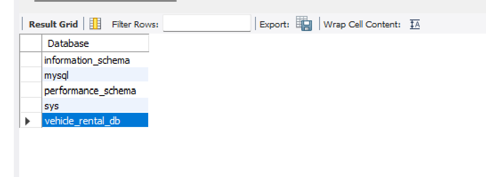

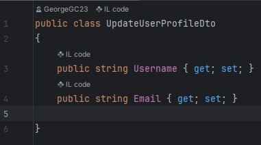
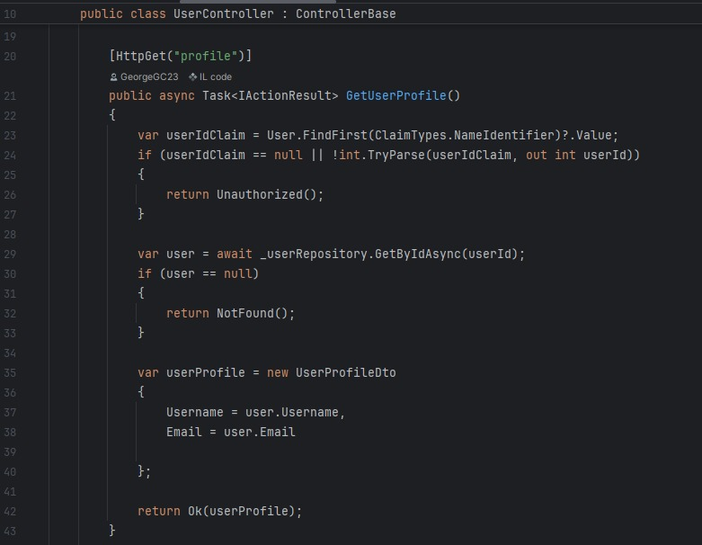

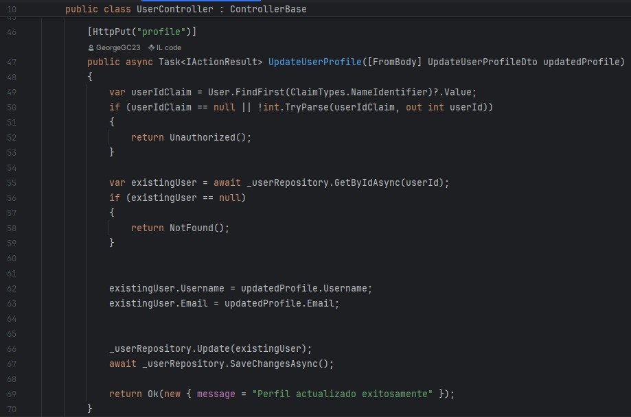

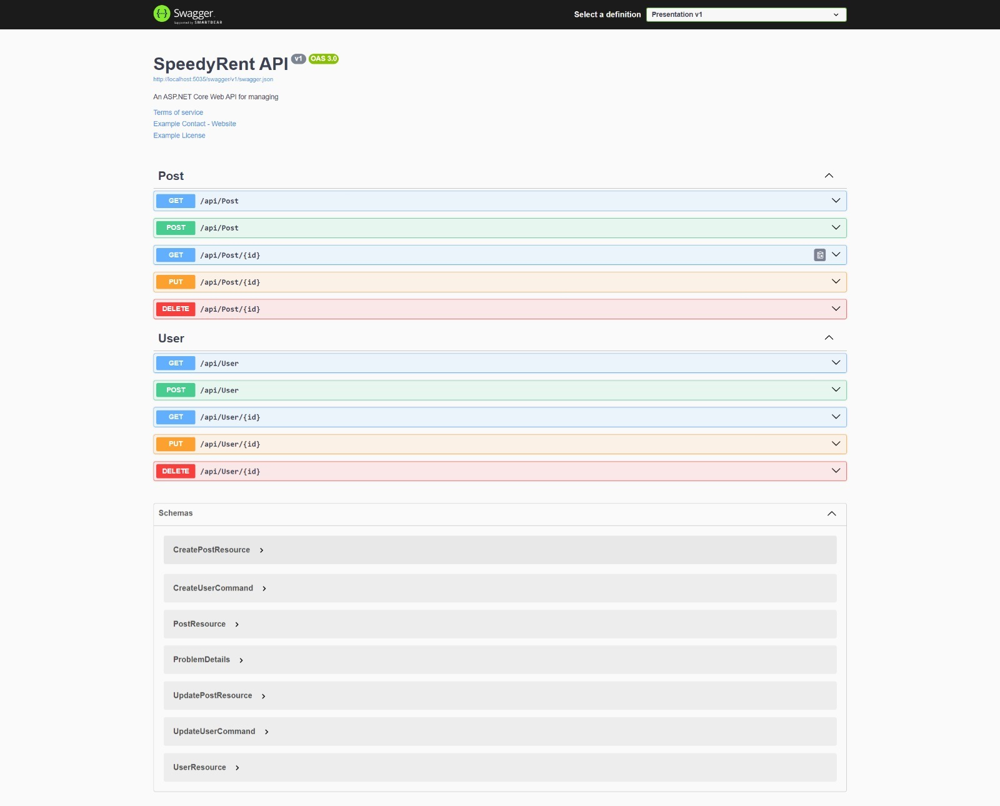

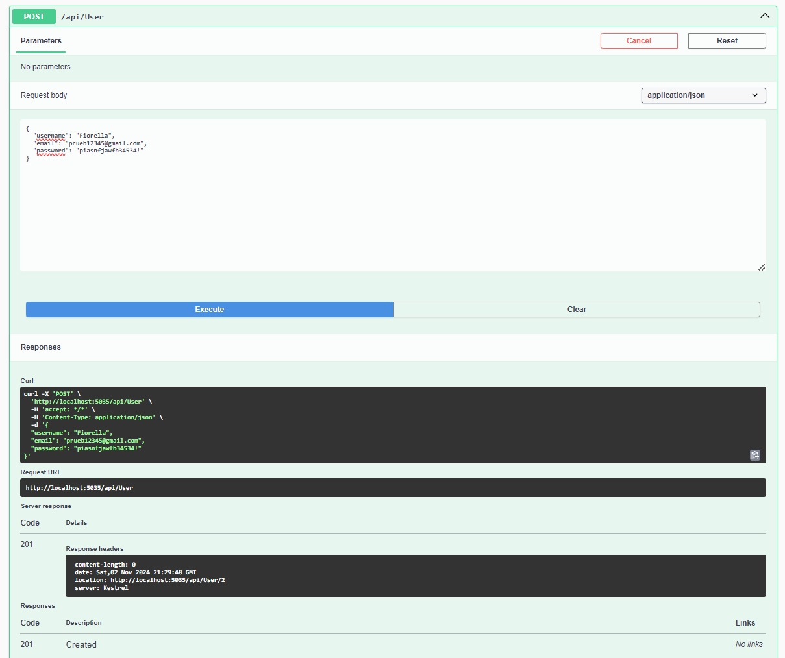

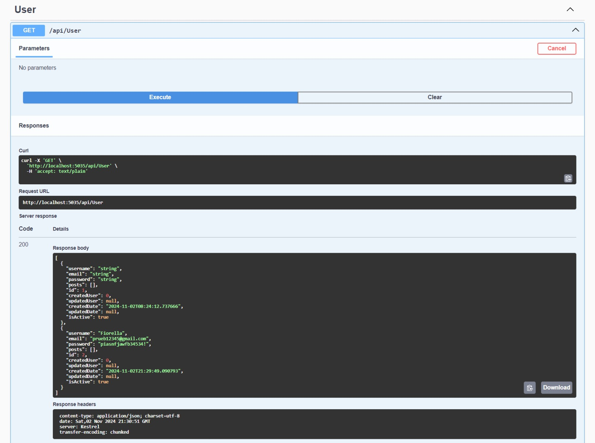

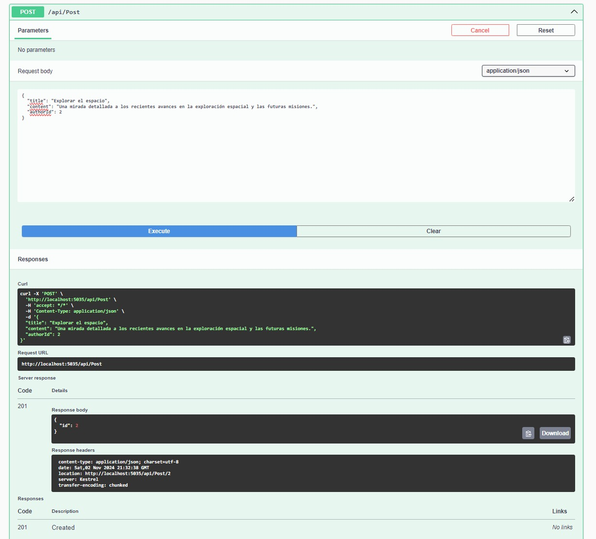
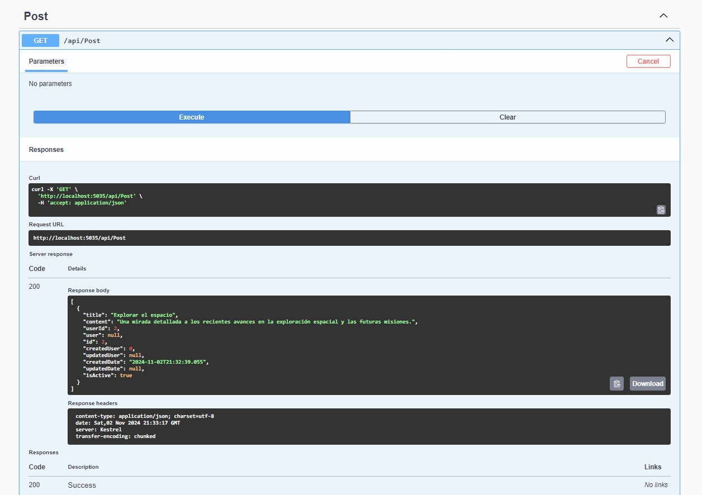

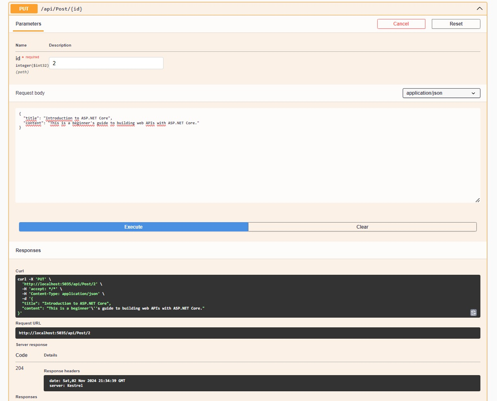

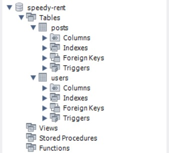

#### 5.2.3.6 Services Documentarion Evidence for Sprint Review
Evidencia del trabajo en el GitHub

#### 5.2.3.7 Software Deployment Evidence for Sprint Review
En el alcance del presente sprint, no se han utilizado servicios de web ya que se ha trabajado solamente el Backend estático. Por lo tanto, en esta presentación no se encuentra documentación de web services empleados.

#### 5.2.3.8 Team Collaboration Insights during Sprint
En esta entrega, el trabajo se estructuró en dos partes principales: el frontend y el backend. En el backend, las secciones desarrolladas por cada integrante se organizaron en una rama distinta. A continuación, se presentan las actividades realizadas por cada miembro del equipo.

| Integrante | Actividad |
|------------|-----------|
|Belleza Tello, Paolo Eduardo| Implementacion del contrato, pagos |
|Fernandez Alva, Maria Fernanda| Implementacion de la nueva estructura del db.json, y la implementacion del i18n|
|Valera Garces, Samuel Ignacio|Implementacion del login-register|
|Vilca Valverde, Fiorella Angela|Implementacion del post community|
|Galván Cerrón, George Aldo|Implementacion del user account|

A continuación, se mostrarán los gráficos de insights durante el sprint: 

* Anexo: Flujo de trabajo entre las ramas del Frontend 

* Anexo: Flujo de trabajo entre las ramas del Backend

### 5.2.4 Sprint 4

#### 5.2.4.1 Sprint Planning 4

#### 5.2.4.2 Sprint Backlog 4

#### 5.2.4.3 Development Evidence for Sprint Review

#### 5.2.4.4 Testing Suite Evidence for Sprint Review

#### 5.2.4.5 Execution Evidence for Sprint Review

#### 5.2.4.6 Services Documentation Evidence for Sprint Review

#### 5.2.4.7 Software Deployment Evidence for Sprint Review

#### 5.2.4.8 Team Collaboration Insights during Sprint

## 5.3 Validation Interviews

### 5.3.1 Diseño de Entrevistas

* Segmento objetivo 1: Arrendatarios  
  Son aquellas personas que desean alquilar un vehículo por un período específico. 
    * Preguntas generales:   
      * **¿Cuál es su nombre completo?**  
      * **¿Cuántos años tienes?**  
      * **¿En que distrito reside?**  
      * **¿A qué se dedicas?**  

   * Preguntas luego de mostrarle la plataforma desplegada:  
     * **¿Fue fácil para ti encontrar un auto que se ajustara a tus necesidades usando los filtros de búsqueda?**  
     * **¿Qué filtros adicionales o mejoras consideras que podrían implementarse?**  
     * **¿Qué tan útil te parece la información de los autos publicada en la aplicación?**  
     * **¿Hay detalles adicionales que te gustaría ver en la descripción de los autos?**  
     * **¿Cómo te gustaría que se manejara la comunicación con el arrendador?**  
     * **¿Prefieres tener algún sistema de mensajería o contacto directo?**  
     * **¿Consideras claras las notificaciones de estado (pendiente, aceptado, rechazado) al solicitar alquilar un auto?**  
     * **¿Qué tan clara te pareció la sección de términos y condiciones antes de solicitar el alquiler?**  
     * **¿Sientes que cubre todas las expectativas y protecciones necesarias?**  
     * **¿Crees que el acuerdo legal al alquilar un auto contiene toda la información necesaria para sentirte seguro?**  

* Segmento objetivo 2: Arrendadores  
  Son aquellas personas que poseen un vehículo y lo pone a disposición de un arrendatario a cambio de un pago.  
    * Preguntas generales:   
      * **¿Cuál es su nombre completo?**  
      * **¿Cuántos años tienes?**  
      * **¿En que distrito reside?**  
      * **¿A qué se dedicas?**  

  * Preguntas luego de mostrarle la plataforma desplegada:  
     * **¿Qué tan fácil fue para ti completar el proceso de publicación de tu auto?**  
     * **¿Qué aspectos específicos consideras que podrían simplificarse o explicarse mejor?**  
     * **¿Qué información adicional sobre el arrendatario te gustaría tener antes de aceptar o rechazar una solicitud de alquiler?**  
     * **¿Cómo evalúas el proceso de configuración de las características y detalles de tu auto?**  
     * **¿Te parece que es suficiente la información que puedes brindar sobre el auto? ¿Qué mejorarías?**  
     * **¿Cuánto tiempo esperas recibir notificaciones sobre las solicitudes de alquiler?**  
     * **¿Qué tan claras te parecen las notificaciones de estado (pendiente, aceptado, rechazado)?**  
     * **¿Cómo evalúas la claridad de los términos y condiciones al momento de subir un auto?**  
     * **¿Hay algo que te gustaría agregar o modificar en los términos?**  
     * **¿Cuáles son tus expectativas para la comunicación o interacción con el arrendatario durante el proceso de alquiler?**  

### 5.3.2 Registro de Entrevistas

**Segmento Objetivo 2: Arrendador**

*Entrevistado 1*

<table border="1" style="text-align: left;">
	<tbody>
		<tr>
			<td colspan="1" rowspan="6"></td>
            <td colspan="1" rowspan="1"><strong>Nombre del entrevistado:
             
            </strong> Lucia
              Fernadez
            </td>
		</tr>
        <tr>
            <td>
            <strong>Edad: </strong> 24 años
             
            </td>
        </tr>
        <tr>
            <td>
            <strong>Distrito:</strong> 
             Estados Unidos
            </td>
        </tr>
        <tr>
            <td>
            <strong>Nombre del entrevistador:</strong>
             Samuel Ignacio
             Valera Garcés
            </td>
        </tr>
        <tr>
            <td>
            <strong>Timming: </strong>
             0:03 
            <strong>Duración: </strong>
             04:26
            </td>
        </tr>
        <tr>
            <td>
             <strong><a href="https://upcedupe-my.sharepoint.com/:v:/g/personal/u202111952_upc_edu_pe/EUVXUgrZ9y9MsBMIHeOQKPcB_XURnMBKetjKihTAeKO-ag?e=KhLX3s&nav=eyJyZWZlcnJhbEluZm8iOnsicmVmZXJyYWxBcHAiOiJTdHJlYW1XZWJBcHAiLCJyZWZlcnJhbFZpZXciOiJTaGFyZURpYWxvZy1MaW5rIiwicmVmZXJyYWxBcHBQbGF0Zm9ybSI6IldlYiIsInJlZmVycmFsTW9kZSI6InZpZXcifX0%3D">URL Entrevista</a></strong>
            </td>
        </tr>        
	</tbody>
</table>

Resumen: 
Lucía Fernández es una joven de 24 años que estaba dispuesta a alquilar su vehículo en una plataforma web. Durante la entrevista, ella explora la funcionalidad de la página, que incluye un proceso sencillo de login, la publicación de vehículos, búsqueda y solicitud de alquiler. Lucía considera el proceso intuitivo y fácil de navegar, destacando que cualquiera podría usarlo sin mayores complicaciones.

Lucía aprecia que la plataforma permita ingresar información detallada del vehículo, como la marca, modelo, año, precio e imagen, ya que lo considera importante para la seguridad y claridad de las publicaciones. No encuentra aspectos que necesiten explicación adicional y destaca los filtros de búsqueda por marca, modelo, año y reputación como herramientas útiles para que los usuarios encuentren lo que buscan rápidamente.

Sin embargo, Lucía sugiere que le gustaría contar con información adicional, como los antecedentes penales de los arrendatarios, antes de aceptar o rechazar una solicitud. Además, considera importante la comunicación directa con el arrendatario durante el proceso de alquiler. En cuanto a los términos y condiciones de uso, que incluyen la condición del vehículo, seguro y certificado de mantenimiento, los encuentra claros y suficientes, sin necesidad de modificaciones.

Lucía expresa que espera recibir solicitudes de alquiler de manera rápida, idealmente de forma instantánea, y se muestra satisfecha con la transparencia y seguridad que ofrece el proceso de publicación y verificación en la plataforma.

**Segmento Objetivo 1: Arrendatario**

*Entrevistado 2*

<table border="1" style="text-align: left;">
	<tbody>
		<tr>
			<td colspan="1" rowspan="6"></td>
            <td colspan="1" rowspan="1"><strong>Nombre del entrevistado:
             
            </strong> Carla Paola
              Taype
            </td>
		</tr>
        <tr>
            <td>
            <strong>Edad: </strong> 26 años
             
            </td>
        </tr>
        <tr>
            <td>
            <strong>Distrito:</strong> 
             Jesús María
            </td>
        </tr>
        <tr>
            <td>
            <strong>Nombre del entrevistador:</strong>
             George Aldo
             Galvan Cerron
            </td>
        </tr>
        <tr>
            <td>
            <strong>Timming: </strong>
             0:08 
            <strong>Duración: </strong>
             2:19
            </td>
        </tr>
        <tr>
            <td>
             <strong><a href="https://upcedupe-my.sharepoint.com/personal/u20211e417_upc_edu_pe/_layouts/15/stream.aspx?id=%2Fpersonal%2Fu20211e417%5Fupc%5Fedu%5Fpe%2FDocuments%2Fentrevista%5Farrendatario%2Emp4&referrer=StreamWebApp%2EWeb&referrerScenario=AddressBarCopied%2Eview%2Ecf7cb133%2D8431%2D431d%2D8b1b%2Dc5e5b36e2a25">URL Entrevista</a></strong>
            </td>
        </tr>        
	</tbody>
</table>

Resumen: 
Carla, de 26 años, es arrendataria y tuvo una experiencia positiva probando nuestra app web. Mencionó que la interfaz es intuitiva y los filtros son adecuados para una búsqueda eficaz. En general, cree que la plataforma ya incluye las funciones necesarias para el arrendatario, por lo que no considera urgente añadir más características, aunque una mejora en la velocidad de carga sería bienvenida.

**Segmento Objetivo 2: Arrendador**

*Entrevistado 3*

<table border="1" style="text-align: left;">
	<tbody>
		<tr>
			<td colspan="1" rowspan="6"></td>
            <td colspan="1" rowspan="1"><strong>Nombre del entrevistado:
             
            </strong> Cristian
             
            </td>
		</tr>
        <tr>
            <td>
            <strong>Edad: </strong> 27 años
             
            </td>
        </tr>
        <tr>
            <td>
            <strong>Distrito:</strong> 
             Jesús María
            </td>
        </tr>
        <tr>
            <td>
            <strong>Nombre del entrevistador:</strong>
             George Aldo
             Galvan Cerron
            </td>
        </tr>
        <tr>
            <td>
            <strong>Timming: </strong>
             0:08 
            <strong>Duración: </strong>
             3:29
            </td>
        </tr>
        <tr>
            <td>
             <strong><a href="https://upcedupe-my.sharepoint.com/:v:/g/personal/u20211e417_upc_edu_pe/EW2HUeoI6rRKrhpMnyINk2cBWN9lo-ZP6dhbTAsAveQicQ?nav=eyJyZWZlcnJhbEluZm8iOnsicmVmZXJyYWxBcHAiOiJPbmVEcml2ZUZvckJ1c2luZXNzIiwicmVmZXJyYWxBcHBQbGF0Zm9ybSI6IldlYiIsInJlZmVycmFsTW9kZSI6InZpZXciLCJyZWZlcnJhbFZpZXciOiJNeUZpbGVzTGlua0NvcHkifX0&e=gyOQjp">URL Entrevista</a></strong>
            </td>
        </tr>        
	</tbody>
</table>

Resumen: 
Christian, de 27 años, es arrendador y tuvo una experiencia sin inconvenientes al probar la app. Sugiere simplificar el proceso de registro inicial, permitiendo que se complete la información detallada más adelante para la verificación de usuario. También recomendó agregar un filtro de colores para los autos. A pesar de estas observaciones, se siente satisfecho y cómodo usando la plataforma.

**Segmento Objetivo 1: Arrendatarios**

*Entrevistado 4*

<table border="1" style="text-align: left;">
	<tbody>
		<tr>
			<td colspan="1" rowspan="6"></td>
            <td colspan="1" rowspan="1"><strong>Nombre del entrevistado:
             
            </strong> Maria Yesenia
              Alva Leyva
            </td>
		</tr>
        <tr>
            <td>
            <strong>Edad: </strong> 45 años
             
            </td>
        </tr>
        <tr>
            <td>
            <strong>Distrito:</strong> 
             Los Olivos
            </td>
        </tr>
        <tr>
            <td>
            <strong>Nombre del entrevistador:</strong>
             Maria Fernanda
             Fernandez Alva
            </td>
        </tr>
        <tr>
            <td>
            <strong>Timming: </strong>
             0:06 
            <strong>Duración: </strong>
             7:08
            </td>
        </tr>
        <tr>
            <td>
             <strong><a href="https://upcedupe-my.sharepoint.com/:v:/g/personal/u20211e417_upc_edu_pe/EWVOMyZ3_xtPiEyUdPjjMsABKw1aN2Q_u7MS5OMEI2BeXA?nav=eyJyZWZlcnJhbEluZm8iOnsicmVmZXJyYWxBcHAiOiJPbmVEcml2ZUZvckJ1c2luZXNzIiwicmVmZXJyYWxBcHBQbGF0Zm9ybSI6IldlYiIsInJlZmVycmFsTW9kZSI6InZpZXciLCJyZWZlcnJhbFZpZXciOiJNeUZpbGVzTGlua0NvcHkifX0&e=2kdMvI">URL Entrevista</a></strong>
            </td>
        </tr>        
	</tbody>
</table>

Resumen: 
La señora Yesenia pensaba que adquirir un auto requeriría mucho papeleo y que el proceso de registro y solicitud sería complicado y tardaría meses. Sin embargo, al conocer Speedy Rent, quedó fascinada. Aunque no es muy experta en tecnología, le encantó poder buscar el auto de sus sueños fácilmente gracias a los filtros de búsqueda. También valoró el nivel de detalle de la información sobre los vehículos y mencionó que le gustaría poder visualizar la ubicación del auto para saber si está cerca o lejos para recogerlo. Además, apreció que haya restricciones claras en la plataforma.

**Segmento Objetivo 2: Arrendador**

*Entrevistado 5*

<table border="1" style="text-align: left;">
	<tbody>
		<tr>
			<td colspan="1" rowspan="6"></td>
            <td colspan="1" rowspan="1"><strong>Nombre del entrevistado:
             
            </strong> Jessica 
              Jaramillo
            </td>
		</tr>
        <tr>
            <td>
            <strong>Edad: </strong> 24 años
             
            </td>
        </tr>
        <tr>
            <td>
            <strong>Distrito:</strong> 
             Comas
            </td>
        </tr>
        <tr>
            <td>
            <strong>Nombre del entrevistador:</strong>
             Maria Fernanda 
             Fernandez Alva
            </td>
        </tr>
        <tr>
            <td>
            <strong>Timming: </strong>
             0:02 
            <strong>Duración: </strong>
             8:08
            </td>
        </tr>
        <tr>
            <td>
             <strong><a href="https://upcedupe-my.sharepoint.com/:v:/g/personal/u20211e417_upc_edu_pe/EbXFCqDplwJJlxdY9NiKFEEBov_4C0f2Or38q9z38Ere5g?nav=eyJyZWZlcnJhbEluZm8iOnsicmVmZXJyYWxBcHAiOiJPbmVEcml2ZUZvckJ1c2luZXNzIiwicmVmZXJyYWxBcHBQbGF0Zm9ybSI6IldlYiIsInJlZmVycmFsTW9kZSI6InZpZXciLCJyZWZlcnJhbFZpZXciOiJNeUZpbGVzTGlua0NvcHkifX0&e=VySt1h">URL Entrevista</a></strong>
            </td>
        </tr>        
	</tbody>
</table>

Resumen: 
Jessica expresó que le encanta el estilo de la página web, describiéndolo como limpio y fácil de entender. Al principio, tenía dudas sobre publicar su auto en nuestra plataforma debido a posibles riesgos, como el robo del vehículo. Sin embargo, le agradó la idea de incluir términos y condiciones al registrar su auto, lo cual la hace sentir más cómoda y segura. También valoró el hecho de que el usuario recoja el vehículo en persona y la posibilidad de tener un contrato físico, ya que le brinda respaldo en caso de cualquier inconveniente con el vehículo.

### 5.3.3 Evaluaciones según heurísticas

DESCRIPCIÓN DE PROBLEMAS:
PROBLEMA #1:
Problema con la eliminación de productos de “mis filtros” ya que si se borran pero
cuando actualizas la página
Severidad: 3
Heurística violada: Usability: Usabilidad y control del usuario
Problema:
Al momento de eliminar el filtro seleccionado, visualmente se
queda pero cuando se actualiza la página, ya se ve que se ha borrado por completo por
lo que ese es un problema para los usuarios que no saben qué hacer en esas
situaciones.

## 5.4 Video About-the-Product
En la siguiente sección se presenta el producto Speedy Rent, destacando las principales funcionalidades de la plataforma, como la creación de un vehículo, la búsqueda de vehículos disponibles, la solicitud para alquilar un vehículo y las notificaciones que recibe el usuario cuando alguien solicita uno de sus vehículos.

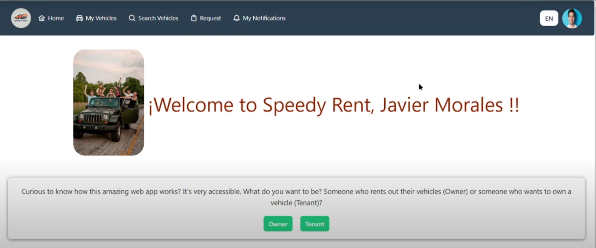

Enlace del video: https://youtu.be/qRTJhe2Z6CY

Duración del video: 11:46

Video About the team: https://youtu.be/Izu9ZLOQju4

Video de exposición: https://youtu.be/EQIwfmtK4wY